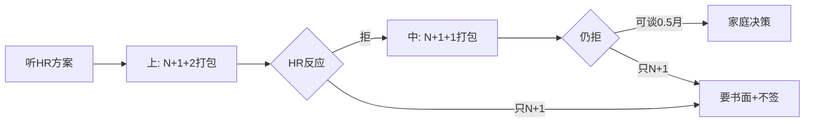

## 2026-05-27 15:54:17

**用户提问**
评估下@离职协商与AI求职过渡方案_v1.0.md

**状态**
等待AI回复

---

## 2026-05-27 15:55:33

**用户提问**
评估下@离职协商与AI求职过渡方案_v1.0.md

**AI最终回复**
## 总体评价

这是一份**结构清晰、立场正确、可执行性强**的家庭决策与谈判准备文档，与你们仓库里的《AI培训班报名评估报告》在方向上**高度一致**：优先争取**时间与现金流**，用**与云履历连贯的 RAG 项目**完成转型，而不是裸辞或被动签「个人原因离职」。

**综合评分（主观）：8.2 / 10**  
适合作为：家庭对齐口径、HR 约谈前 checklist、交给律师/仲裁窗口二次核对的底稿。  
**不能替代**：当地律师意见、公司具体合同条款、北京当年社平工资三倍封顶等精确计算。

---

## 做得好的地方

| 维度 | 评价 |
| --- | --- |
| 核心立场 | 「不主动辞职、不签个人原因、要书面方案」——这是协商解除里最关键的三条，文档抓得很准 |
| 目标组合 | 「带薪过渡 + N+1 + 权益结清 + 友好离职证明 + 竞业不启动」比单纯盯 N 更贴近魏娜的真实需求（转 AI 要时间） |
| 方案对比表 | A–F 六档对比清楚，尤其点出了 **E 方案（口头放弃加班费换时间）** 的高风险，很实用 |
| 加班工资策略 | 「先取证、作筹码、不单独书面放弃、总额覆盖才写一揽子和解」——策略成熟 |
| 哺乳期时点 | 不夸大违法，但把「时间点敏感」作为谈判语气与风险提醒，分寸合适 |
| 会议动作 | 约谈前/中/后的清单和**会后留痕模板**可直接复制使用 |
| 协议条款 | 第 九 节「必须写清 / 应避免」是全文最有长期价值的部分 |
| AI 过渡 | 8–12 周路径 +「云运维知识库 RAG」与现有技能连续，和培训班评估结论互相印证 |
| 免责与边界 | 开篇已声明非律师意见，并列出二次审核问题，专业态度到位 |

---

## 需要补强或修正的点

### 1. `N` 的表述要再「钉死日期」

文档里 4.5 年对应 **4.5 个月还是 5 个月**，取决于**入职日 + 拟解除日**是否满「另 6 个月」：

- 满 4 年 + **不足 6 个月**：N = **4.5**
- 满 4 年 + **满 6 个月及以上**：N = **5**

建议在正文加一行：**「请用劳动合同入职日与公司书面解除日逐日推算，不要只用约数 4.5 年。」** 谈判时若 HR 按 4.5 算，而你实际已满 4 年 6 个月，差额是半个月工资，值得争。

### 2. `N+1` 的法律含义要写清

实务里 HR 说的 `N+1` 常指：

- **经济补偿 N** + **代通知金 1 个月**（劳动合同法第 40 条情形且未提前 30 日书面通知），或  
- **协商打包口径**（并不严格对应法条）

协商解除**法律上并不强制** `N+1`；公司若走第 39/40/41 条单方解除，才涉及不同程序与是否 +1。建议在文档加一小段：**「先问清公司主张的解除路径（39/40/41/协商），再判断 +1 是否法定、是否可谈更高。」**

### 3. `2N` 与协商的关系

文档提到违法解除 `2N` 作为筹码是对的，但要避免家庭产生**「一定能拿 2N」**的错觉。实践中：

- 协商阶段：多用「争议空间」抬价，未必真打仲裁  
- 真仲裁：举证、程序、解除理由认定都耗精力  

建议在「方案 F」旁加一句：**「2N 是上限参照，不是默认到手价。」**

### 4. 北京地区落地信息偏薄

第十二节第 9 问点了北京社保、公积金、补偿个税，正文几乎未展开。建议补充（签协议前向律师/税务核实）：

- **经济补偿金个税**：符合规定的经济补偿在当地标准内部分往往有免税处理，**超出部分、其他名目的「额外补偿」** 税务处理可能不同  
- **社保公积金**：断缴月份、补缴、封存与提取规则按北京现行政策核对  
- **未休年假**：按《职工带薪年休假条例》折算，写进协议「天数 × 日工资」或单独一行  

### 5. 协商期间被边缘化/降薪/绩效施压

第十二节第 8 问提了，正文缺少**操作步骤**。建议增补：

- 继续出勤、保留打卡/邮件/派工记录  
- 对降薪、调岗、新绩效标准要求**书面说明与依据**  
- 不签收单方面不利的绩效考核表（或签收注明「保留异议」）  
- 出现明显逼退迹象时，同步咨询律师，评估是否构成变相违法解除  

### 6. 一揽子和解条款的风险再强调

第九条已写「补偿已包含全部争议款项」的风险，可再补**反面示例**：

- 避免「双方再无任何劳动争议」而无金额明细  
- 若接受一揽子，应列明：**经济补偿 X、代通知金 Y、未休年假 Z、加班费 W、奖金 V**，并写「除此之外无其他应付项」

### 7. AI 求职时间线的假设

「3 个月带薪过渡」与 8–12 周学习表是匹配的；若只谈到 **2 个月** 或 **立即离职 + N+2**，应把学习表压缩为 **6–8 周 MVP**（先 RAG Demo + 简历，再边投边补）。文档可写一句**弹性版本**，避免过渡不足仍按 12 周规划。

---

## 对第十二节「二次审核问题」的简要回应

| # | 问题 | 简要结论 |
| ---: | --- | --- |
| 1 | 4.5 年 N 是 4.5 还是 5？ | **看是否满 4 年另 6 个月**；满则 5，不满则 4.5 |
| 2 | 不能胜任 / 客观情况变化 / 经济性裁员 | 分别对应 **第 39/40/41 条**，程序、培训、调岗、提前 30 日通知或 +1、裁员方案与报备等要求不同；**让 HR 书面写明依据与程序** |
| 3 | 哺乳期刚结束约谈 | 哺乳期已结束，单纯「刚结束就谈」**不一定构成违法**；若此前已有逼退、降薪、解除意图证据，可加强**恶意与谈判筹码**；不宜当作「必胜点」 |
| 4 | 996/加班费时效与举证 | 仲裁时效一般为知道权利被侵害之日起 **1 年**（劳动关系终止的有时从终止日起算，以当地实践为准）；举证：**考勤、工资条、制度、沟通记录**；曾发 3 个月加班费可证明**加班事实曾被认可** |
| 5 | 带薪过渡 vs 立即 N+2 | **现金流紧、公司急裁** → 更高一次性更易谈；**要转 AI、要社保连续** → 带薪过渡更值；魏娜画像偏后者 |
| 6 | 哪些条款会放弃加班费/年假等 | 「再无争议」「全部权利义务结清」「放弃追索」且**无分项金额**；「自愿放弃」无对价；模糊写「补偿包含一切」 |
| 7 | 无书面方案只口头施压 | **会后邮件/微信纪要**（文档已有模板）、录音注意合法性、保存 HR 通知、拒绝当场签字 |
| 8 | 协商期间调岗降薪等 | 见上文第 5 点，书面异议 + 证据 + 律师 |
| 9 | 北京社保公积金个税 | 需**当地当年数据与个税规则**专项核对，本文档宜标「待律师填数」 |
| 10 | 2–3 个月缓冲 vs 多 1 个月补偿 | 对**转 AI 应用岗、需做可演示项目**的魏娜，**多数情况下缓冲期价值 > 多 1 个月工资**（与培训班评估一致） |

---

## 与《AI培训班报名评估》的一致性

两份文档可一起用于家庭决策：

- **离职方案**：争取时间 + 不断社保 + 不签个人原因  
- **培训评估**：暂缓高价报班，用缓冲期做 **云运维 RAG**  
- **冲突点**：若公司只给「立即 N+1」且很急，需提前决定是**拿钱快投**还是**再拖 1–2 轮争取过渡**；文档第十一节优先级已覆盖，执行时要把 **「最低可接受组合」** 写死（例如：2 个月过渡 + N+1 + 年假结清，否则咨询律师）

---

## 建议的下一步（按优先级）

1. **48 小时内**：按第八节清单备份证据；若已约谈，发第八节「约谈后」纪要模板。  
2. **算清三个数**：精确 N、近 12 个月平均工资基数、未休年假折算金额（粗算即可）。  
3. **定家庭底线表**：最优 / 可接受 / 底线三档（第五节已有，建议填具体金额区间）。  
4. **签任何字之前**：劳动律师或北京仲裁委咨询（带合同 + HR 书面或纪要）。  
5. **若谈到 2–3 个月过渡**：同步启动第十节 RAG 项目周计划（与是否报班无关）。

---

## 结论

这份 v1.0 **可以直接用于家庭决策和谈判准备**，逻辑、立场、条款清单都达到「非律师自制方案」里的**上乘水平**。主要缺口是：**北京落地数字、解除路径（39/40/41/协商）细分、协商期间反施压 playbook、N 的精确日算**。补完上述内容后，再交给律师过一遍协议模板，风险会明显下降。

如果你愿意，我可以基于本文档直接改一版 **v1.1**（补北京待填项、N 日算示例、边缘化应对、压缩版 AI 时间线），或单独起草一份 **《协商解除协议核对清单》** 供签字前逐项打勾。

---

## 2026-05-27 19:14:41

**用户提问**
第一次沟通逐字稿.md 是与hr的第一次沟通记录，下面是两个ai的分析结果：
DeepSeek：
## 第一次沟通逐字稿分析完成

### 魏娜表现：四项做得好
1. 当场纠正HR的N计算错误（N=4 → 4.5）
2. 三次拒绝当场计算加班费，坚守「不现场做决定」原则
3. 主动提出社保衔接需求
4. 追问工资基数差异（合同19,000 vs HR算18,471）

### 关键新事实
- 入职日：2022年2月21日（HR口径）/ 2月23日（魏娜口径）
- N基数月均 ≈ 18,471，N+1总额 ≈ 102,120
- 加班期：陈同团队，996→995→994，约一年
- HR两年前就讨论过岗位优化，因怀孕哺乳暂停
- 年终奖确认归零
- 社保二选一：N+1到5月底 vs 延到6月但无+1

### 最关键的发现：HR不是「可争取的朋友」
这位HR的实战行为（迟到早退施压、假deadline、反复催逼底牌）与沟通手册v2.1的「交易对手方」框架存在策略错配。面对「施压型HR」，姿态需要从「请帮忙」上调为「对等谈判」。

### 明天行动建议
1. 今晚：核算12个月工资流水、确认入职日、算加班费要价、家庭决策选N+1 vs 延6月
2. 明天：用「对等谈判」姿态，给偏高的加班+过渡打包要价，不接受现场签字，不被「迟到早退」带偏
codex：
我看完了。这个录音对你们是有价值的，核心不是“她们给了 N+1”，而是 HR 亲口确认了几个关键事实。

**关键收获**
1. HR 明确说：岗位两年前就沟通过优化，后来因为怀孕、哺乳期没继续，现在哺乳期满了才推进。  
   这说明公司确实是在等特殊保护期结束后处理，时间线很敏感。

2. HR 口径是“组织架构调整、岗位不再设置、协商解除”。  
   这对你们有利：不是你老婆主动离职，不应写个人原因。

3. HR 给的金额：`N = 83120`，`N+1 = 102120`。  
   倒推月均工资大约 `83120 / 4.5 = 18471`。她合同工资 19000，HR 解释低 600 左右是因为事假、长假、补助扣除。这个金额需要核对，但差额不算巨大。

4. HR 对加班费的态度是：让你们自己报总金额，公司不想逐日核。  
   这正好适合你们谈“打包 1 个月”：“历史加班逐日核算很复杂，为快速协商，在 N+1 基础上增加 1 个月作为历史加班和过渡影响打包补偿。”

5. HR 用“迟到早退”反制加班费。  
   说明加班费单独硬刚会被拉入互相举证，不适合当主战场。继续把它作为谈判筹码比较好。

6. HR 的“6 月离职就不给 +1”这个口径要谨慎看。  
   如果公司走《劳动合同法》第四十条的单方解除，确实有“提前 30 日书面通知或额外支付 1 个月工资”的逻辑。但现在她们说的是“协商解除”，不是已经完成合法单方解除。下一轮不要和她争法条，直接要她写清：到底是协商解除，还是第 40 条单方解除。

**下一轮核心目标**
不要再现场算加班费细账。直接给一个总包诉求：

> 我回去核对了。公司目前给的 `N+1` 是 102120 元，我理解这个是法定基础方案。但考虑到历史加班、哺乳期刚结束后的就业过渡、孩子医保和工作居住证衔接，我希望在 `N+1` 基础上，再增加 1 个月工资作为打包补偿。也就是 `N+1+1`。这样双方不用逐项核每一天加班，也能尽快协商解决。

同时补一句：

> 另外，解除性质、最后工作日、社保公积金缴纳月份、社保减员原因、离职证明、未休年假和报销，都需要在协议里写清楚，不能写个人原因离职。

**关于社保**
HR 说“延到 6 月就不给 +1”，不要当场争。你们可以这样回应：

> 6 月社保涉及孩子医保和工作居住证衔接，我需要核对政策。公司可以把 5 月底离职方案和 6 月底离职方案都写清楚，包括补偿金额、社保公积金、个人承担部分和离职证明口径，我对比后反馈。

这样她们就不能口头来回变。

**注意一个纪要错误**
AI 纪要里写“绩效为 1”，但逐字稿里 HR/4号说的是“绩效为零 / 年终奖系数为零”。如果后续引用，以逐字稿为准。

**我的判断**
你们现在的策略应该从“争 N+2/N+3”收敛到更现实的：

> 对外开口：`N+2` 或更合理总包  
> 真实目标：`N+1+1`  
> 最低防线：`N+1` 算足 + 工资/年假/报销/社保/离职证明/社保减员原因都安全

这次录音强化了 `N+1+1` 的合理性：HR 已承认组织优化、孕哺期后处理、曾有 996 阶段，也愿意听你们报一个总金额。

参考法律底座：用人单位提出协商一致解除应支付经济补偿；第 40 条才涉及提前 30 日书面通知或额外支付 1 个月工资；经济补偿按工作年限和前 12 个月平均工资计算。来源：[劳动合同法](https://www.samr.gov.cn/zw/zfxxgk/fdzdgknr/bgt/art/2023/art_0abfdd261c03417b949df19d869add8d.html)、[中国就业网关于第40条说明](https://chinajob.mohrss.gov.cn/h5/c/2024-07-23/413224.shtml)。

**状态**
等待AI回复

---

## 2026-05-27 19:16:38

**用户提问**
第一次沟通逐字稿.md 是与hr的第一次沟通记录，下面是两个ai的分析结果：
DeepSeek：
## 第一次沟通逐字稿分析完成

### 魏娜表现：四项做得好
1. 当场纠正HR的N计算错误（N=4 → 4.5）
2. 三次拒绝当场计算加班费，坚守「不现场做决定」原则
3. 主动提出社保衔接需求
4. 追问工资基数差异（合同19,000 vs HR算18,471）

### 关键新事实
- 入职日：2022年2月21日（HR口径）/ 2月23日（魏娜口径）
- N基数月均 ≈ 18,471，N+1总额 ≈ 102,120
- 加班期：陈同团队，996→995→994，约一年
- HR两年前就讨论过岗位优化，因怀孕哺乳暂停
- 年终奖确认归零
- 社保二选一：N+1到5月底 vs 延到6月但无+1

### 最关键的发现：HR不是「可争取的朋友」
这位HR的实战行为（迟到早退施压、假deadline、反复催逼底牌）与沟通手册v2.1的「交易对手方」框架存在策略错配。面对「施压型HR」，姿态需要从「请帮忙」上调为「对等谈判」。

### 明天行动建议
1. 今晚：核算12个月工资流水、确认入职日、算加班费要价、家庭决策选N+1 vs 延6月
2. 明天：用「对等谈判」姿态，给偏高的加班+过渡打包要价，不接受现场签字，不被「迟到早退」带偏
codex：
我看完了。这个录音对你们是有价值的，核心不是“她们给了 N+1”，而是 HR 亲口确认了几个关键事实。

**关键收获**
1. HR 明确说：岗位两年前就沟通过优化，后来因为怀孕、哺乳期没继续，现在哺乳期满了才推进。  
   这说明公司确实是在等特殊保护期结束后处理，时间线很敏感。

2. HR 口径是“组织架构调整、岗位不再设置、协商解除”。  
   这对你们有利：不是你老婆主动离职，不应写个人原因。

3. HR 给的金额：`N = 83120`，`N+1 = 102120`。  
   倒推月均工资大约 `83120 / 4.5 = 18471`。她合同工资 19000，HR 解释低 600 左右是因为事假、长假、补助扣除。这个金额需要核对，但差额不算巨大。

4. HR 对加班费的态度是：让你们自己报总金额，公司不想逐日核。  
   这正好适合你们谈“打包 1 个月”：“历史加班逐日核算很复杂，为快速协商，在 N+1 基础上增加 1 个月作为历史加班和过渡影响打包补偿。”

5. HR 用“迟到早退”反制加班费。  
   说明加班费单独硬刚会被拉入互相举证，不适合当主战场。继续把它作为谈判筹码比较好。

6. HR 的“6 月离职就不给 +1”这个口径要谨慎看。  
   如果公司走《劳动合同法》第四十条的单方解除，确实有“提前 30 日书面通知或额外支付 1 个月工资”的逻辑。但现在她们说的是“协商解除”，不是已经完成合法单方解除。下一轮不要和她争法条，直接要她写清：到底是协商解除，还是第 40 条单方解除。

**下一轮核心目标**
不要再现场算加班费细账。直接给一个总包诉求：

> 我回去核对了。公司目前给的 `N+1` 是 102120 元，我理解这个是法定基础方案。但考虑到历史加班、哺乳期刚结束后的就业过渡、孩子医保和工作居住证衔接，我希望在 `N+1` 基础上，再增加 1 个月工资作为打包补偿。也就是 `N+1+1`。这样双方不用逐项核每一天加班，也能尽快协商解决。

同时补一句：

> 另外，解除性质、最后工作日、社保公积金缴纳月份、社保减员原因、离职证明、未休年假和报销，都需要在协议里写清楚，不能写个人原因离职。

**关于社保**
HR 说“延到 6 月就不给 +1”，不要当场争。你们可以这样回应：

> 6 月社保涉及孩子医保和工作居住证衔接，我需要核对政策。公司可以把 5 月底离职方案和 6 月底离职方案都写清楚，包括补偿金额、社保公积金、个人承担部分和离职证明口径，我对比后反馈。

这样她们就不能口头来回变。

**注意一个纪要错误**
AI 纪要里写“绩效为 1”，但逐字稿里 HR/4号说的是“绩效为零 / 年终奖系数为零”。如果后续引用，以逐字稿为准。

**我的判断**
你们现在的策略应该从“争 N+2/N+3”收敛到更现实的：

> 对外开口：`N+2` 或更合理总包  
> 真实目标：`N+1+1`  
> 最低防线：`N+1` 算足 + 工资/年假/报销/社保/离职证明/社保减员原因都安全

这次录音强化了 `N+1+1` 的合理性：HR 已承认组织优化、孕哺期后处理、曾有 996 阶段，也愿意听你们报一个总金额。

参考法律底座：用人单位提出协商一致解除应支付经济补偿；第 40 条才涉及提前 30 日书面通知或额外支付 1 个月工资；经济补偿按工作年限和前 12 个月平均工资计算。来源：[劳动合同法](https://www.samr.gov.cn/zw/zfxxgk/fdzdgknr/bgt/art/2023/art_0abfdd261c03417b949df19d869add8d.html)、[中国就业网关于第40条说明](https://chinajob.mohrss.gov.cn/h5/c/2024-07-23/413224.shtml)。

**AI最终回复**
我对照了 [`第一次沟通逐字稿.md`](与HR沟通记录/第一次沟通逐字稿.md) 和你们已更新的 [`离职协商与AI求职过渡方案_v2.0.md`](离职协商与AI求职过渡方案_v2.0.md)。两份 AI 分析**大方向一致、且与录音事实基本吻合**；下面做交叉核对、纠偏和明天可执行建议。

---

## 一、两份分析的共同判断（可采纳）

| 判断 | 逐字稿依据 | 评价 |
| --- | --- | --- |
| 魏娜当场纠正 N=4→4.5 | 约 04:32–05:02 | **成立**，直接保住约半个月工资 |
| 三次顶住「当场算加班费」 | 05:33、05:57、06:45 等 | **成立**，符合「不现场交底」 |
| HR 承认两年前就谈优化、孕哺期暂停 | 00:00:11 段 | **成立**，时间线敏感，可作打包理由之一 |
| 解除口径是组织调整、协商解除 | 全程 | **成立**，不要写成个人原因离职 |
| N=83,120，N+1=102,120 | 02:47、10:21 | **成立**；+1 按 **19,000**（合同工资），不是 18,471 |
| 加班费适合「总包」不宜逐日硬刚 | 「只谈总金额」「你报金额」+ 迟到早退对冲 | **成立**，与 v2.0 策略一致 |
| HR 属施压型，非「可争取的朋友」 | deadline、当场算、不耐烦 | **成立**；手册 v2.2 的「交易对手方」更合适 |
| 现实目标从 N+2/N+3 收敛到 **N+1+1** | 证据弱 + HR 愿听总价 | **合理**，与 v2.0 第四节一致 |
| AI 纪要「绩效为 1」有误 | 08:50 为「绩效为零、年终奖为零」 | **Codex 纠正对**，以后只引用逐字稿 |

---

## 二、需要补充或细化的点（两份分析未写透）

### 1. 「+1」的法律框架要心里有数，嘴上别跟 HR 硬辩

HR 把 +1 说成「未提前 30 日书面通知的代通知金」（07:27–12:08），这是**第 40 条单方解除**的语境。

但整场谈的是**「协商解除」**——法条上**并不强制** N+1；102,120 是公司打包口径。

**实操含义：**

- 不必在会议室争「6 月 30 日算不算满 30 天通知」谁对谁错（魏娜 12:07 已质疑，HR 12:15 顶回来）。
- 明天用 Codex/v2.0 的话术：**要书面两套方案**（5 月底 N+1 vs 6 月底方案含金额、社保、个人承担、是否含等价补偿），把口头博弈变成纸面比价。
- 「延到 6 月就没有 +1」是 HR **定价杠杆**，不是你们必须接受的唯一结构；可谈 **6 月社保 + 总包不低于 N+1+1（或分项等价）**。

### 2. +1 用 19,000、N 用 18,471——明天可轻点一句

`102,120 − 83,120 = 19,000`，说明代通知金按**合同月工资**，N 按**前 12 个月平均**。差额约 529×4.5≈2,380，v2.0 判断「不值得为主战场」合理；若 12 个月流水核对后差异更大，再单独提。

### 3. HR 开场「工作已结束」+「没什么要交接」

- 00:00「工作已结束」
- 07:02「你也没有什么工作需要交接」

说明公司**不打算给带薪过渡期**，「3 个月过渡」开口锚点现实概率低（v2.0 已写）。明天主攻 **N+1+1 + 材料干净 + 快速落地**，别在过渡月上耗太久。

### 4. 「顾问协议延到 6 月」要警惕

07:27 HR 提到延到 6 月可写**顾问协议**、无 +1、社保个人部分自掏。

需书面弄清：是否算劳动关系、工资怎么发、公积金是否仍缴、是否影响失业金/工居。未弄清前**不要口头选 6 月方案**。

### 5. 魏娜可改进的一处（不影响大局）

13:00「我目前还没想好」略被动。明天用**已定数字**替代：「总诉求是 N+1 再加 1 个月打包；细则我写邮件/微信给你。」

### 6. DeepSeek「偏高打包要价」与 Codex「N+1+1」

不矛盾：建议**对外一口价约 121,120（N+1+1）**，内心可接受 **N+1 + 0.5～1 个月打包**；勿报「三个月加班费」式细账，避免被拉进迟到早退对账。

---

## 三、社保二选一：建议默认选 N+1（与 v2.0 一致）

HR 口径：5 月底离职有 N+1；延到 6 月交社保则**没有 +1**（差额约 19,000）。

| 选项 | 约到手 | 说明 |
| --- | ---: | --- |
| 5 月底 N+1 | 102,120 + 打包谈判空间 | 多拿的 19,000 通常大于 1 个月灵活就业成本 |
| 6 月底仅 N | 83,120 | 仅当**工居/孩子医保断缴后果**核实后无法替代时再考虑 |

**今晚必做（签字前）：** 核实工居注销规则、孩子医保是否绑母职工居、灵活就业/配偶/天津衔接是否可行。核实前**不要为 6 月社保当场放弃 +1**。

对 HR 可说（Codex 版，可直接用）：

> 6 月社保涉及孩子医保和工作居住证，我需要核对政策。请把 5 月底方案、6 月底方案都写成书面：补偿总额、社保公积金缴到哪个月、个人承担部分、离职证明和社保减员原因。我对比后反馈。

---

## 四、明天第二轮：统一行动脚本

**姿态：** 对等谈判；不吵、不普法；**一个总价 + 书面两套方案 + 不现场签字**。

**主诉求（建议照读或略改）：**

> 我回去核对了。公司给的 N+1 是 102120 元，我理解这是基础方案。考虑到历史加班、岗位优化在孕哺期后推进、孩子医保和工作居住证、以及再就业过渡，希望在 N+1 基础上**再增加 1 个月工资作为打包补偿**，按 **N+1+1** 协商，加班不逐日核。  
> 另外，解除性质、最后工作日、社保公积金缴到哪个月、**社保减员原因**、离职证明、未休年假和报销，都要写进协议，**不能写个人原因离职**。

**若 HR 再提迟到早退：**

> 如果公司要作为扣减依据，请给明细和制度。今天我谈的是协商解除的**整体方案**，不是逐项对考勤。

**若催当场签字或「就这一次」：**

> 我需要书面方案带回家核对，不会现场签。明天可以给总诉求，协议要过一夜。

**底线（家庭先对齐）：**

- **最低：** N+1（102,120）算足 + 无争议权益（工资至最后工作日、年假、报销）+ 离职证明/减员原因安全  
- **目标：** **N+1+1（约 121,120）** 或等价（如 N+1 + 明确分项「历史权益打包 1 个月」）  
- **开口：** 可略高（如 N+1+1 再加友好离职证明/付款期限），留让步到 1 个月打包  

**不建议：** 明天带一页纸逐日加班费；与 HR 争第 40 条通知期天数；为 6 月社保口头放弃 +1。

---

## 五、DeepSeek vs Codex：谁更准？

| 维度 | DeepSeek | Codex | 我的取舍 |
| --- | --- | --- | --- |
| 魏娜表现复盘 | 四条具体优点 | 偏信息提炼 | **DeepSeek 更贴复盘** |
| HR 类型 | 强调策略错配、上调至对等谈判 | 隐含在「不要争法条」里 | **DeepSeek 对心态更有用**；话术用 Codex/v2.0 |
| 谈判目标 | 偏高打包 + 对等姿态 | N+1+1 + 书面双方案 | **以 Codex/v2.0 为准**，DeepSeek「偏高」= 开口锚，不是三个月加班费 |
| 法律表述 | 较少 | 区分协商 vs 第 40 条 | **Codex 更稳** |
| 社保 | 家庭二选一 | 不当场争、要书面双方案 | **合并执行** |

两份分析**不冲突**，可合并为 v2.0 已写的「施压型 HR + N+1+1 + 社保书面比价」。

---

## 六、今晚 checklist（比「算加班费细账」更重要）

1. **12 个月流水**：验证 18,471；差额小则不在此纠缠。  
2. **劳动合同入职日**：2/21 还是 2/23（对 N=4.5 影响极小，但协议要写准）。  
3. **工居 + 孩子医保**：决定能否默认选 5 月 N+1。  
4. **家庭数字对齐**：开口 121,120；目标 N+1+1；底线 102,120 + 材料干净。  
5. **会后留痕**（若 5/27 未发）：按 v2.0/手册发微信或邮件纪要——未同意解除、未申请离职、请书面方案。  
6. **勿用 AI 纪要作证据**：绩效「为 1」为误，以逐字稿为准。

---

## 七、总判断

第一次沟通**对你们是有利的**：关键事实（优化两年前、孕哺暂停、996 阶段、N+1 数字、协商口径、打包谈加班费）已从 HR 口中固定；魏娜守住了**不现场算、不签、纠正 N** 三条线。

策略上应从 v1.0 的「争取 2～3 个月过渡」**收敛**到 v2.0 的 **N+1+1 + 快速离职 + AI 项目**，这与两份 AI 分析及录音内容一致。

明天关键不是「算赢加班费」，而是：**一口价 N+1+1（或书面等价）、两套社保方案书面化、协议分项与不签个人原因**——用对等、平静的语气说完，不被「今天务必算清」「迟到早退」带节奏。

若你愿意，我可以把以上内容压成一页 **《5/28 第二轮沟通备忘》** 写进 `离职谈判/` 目录，方便魏娜开会前扫一眼。

---

## 2026-05-27 19:22:54

**用户提问**
我的问题：求其上，得其中；求其中，得其下；求其下，必败。从这个角度出发，我该如何制定策略？
下面是两个ai的回答：

codex：
这句话用在这件事上，很对，但要加一个前提：**“求其上”是对外报价，不是内心执念；“得其中”是可接受成交；“求其下”才是危险。**

你们可以按三层策略来定：

**上策：对外开口**

目标不要直接说 `N+1+1`，因为那是你心里的真实目标。对外可以开：

> `N+2` 或 `N+1 + 2个月过渡影响/历史加班打包补偿`

话术：

> 公司现在给的 `N+1` 我理解是基础方案。但考虑到岗位优化在孕哺期后推进、历史加班、孩子医保和工作居住证衔接、以及后续就业过渡，我希望在 `N+1` 基础上增加 2 个月作为整体打包补偿。这样双方不逐项拉扯，也能尽快结案。

这里的“2个月”就是求其上。不是说一定拿到，而是给让步空间。

**中策：真实成交目标**

你们真正想拿的是：

> `N+1+1`，也就是 102120 + 约 19000 = 约 121000，再加无争议权益结清和离职材料干净。

如果 HR 说 2 个月不可能，你就退到：

> 那至少在 `N+1` 基础上增加 1 个月，作为历史加班和就业过渡的打包补偿。这样我可以不再逐日追加班，也能尽快配合结案。

这就是“得其中”。

**下策：最低防线**

如果公司完全不让步，最低也不能低于：

> `N+1` 算足 + 工资/年假/报销结清 + 离职证明协商一致 + 社保减员原因不是个人辞职 + 孩子医保/工居衔接核清。

这个是防守线，不是开口线。不要一开始就把它说出去。

**最忌讳的策略**

一上来就说：

> 我们就要 `N+1+1`，不给就算了。

这会让 HR 从 `N+1+1` 往下砍，最后可能变成 `N+1`。  
更糟的是一上来就讨论 `N+1` 是否能接受，那就是“求其下”。

**明天具体打法**

1. 第一口开 `N+1+2`，不要开 `N+1+1`。
2. 如果 HR 反弹，就退到 `N+1+1`。
3. 如果 HR 只给 `N+1`，不要当场答应，转而要求把年假、报销、社保、离职证明、社保减员原因都写清，再回家判断。
4. 全程不说“这是我的底线”。

一句话策略：

> 对外求 `N+1+2`，真实拿 `N+1+1`，最低守 `N+1` 干净离职；不要把最低线说成目标。

DeepSeek：
这句话用在这件事上，很对，但要加一个前提：**“求其上”是对外报价，不是内心执念；“得其中”是可接受成交；“求其下”才是危险。**

你们可以按三层策略来定：

**上策：对外开口**

目标不要直接说 `N+1+1`，因为那是你心里的真实目标。对外可以开：

> `N+2` 或 `N+1 + 2个月过渡影响/历史加班打包补偿`

话术：

> 公司现在给的 `N+1` 我理解是基础方案。但考虑到岗位优化在孕哺期后推进、历史加班、孩子医保和工作居住证衔接、以及后续就业过渡，我希望在 `N+1` 基础上增加 2 个月作为整体打包补偿。这样双方不逐项拉扯，也能尽快结案。

这里的“2个月”就是求其上。不是说一定拿到，而是给让步空间。

**中策：真实成交目标**

你们真正想拿的是：

> `N+1+1`，也就是 102120 + 约 19000 = 约 121000，再加无争议权益结清和离职材料干净。

如果 HR 说 2 个月不可能，你就退到：

> 那至少在 `N+1` 基础上增加 1 个月，作为历史加班和就业过渡的打包补偿。这样我可以不再逐日追加班，也能尽快配合结案。

这就是“得其中”。

**下策：最低防线**

如果公司完全不让步，最低也不能低于：

> `N+1` 算足 + 工资/年假/报销结清 + 离职证明协商一致 + 社保减员原因不是个人辞职 + 孩子医保/工居衔接核清。

这个是防守线，不是开口线。不要一开始就把它说出去。

**最忌讳的策略**

一上来就说：

> 我们就要 `N+1+1`，不给就算了。

这会让 HR 从 `N+1+1` 往下砍，最后可能变成 `N+1`。  
更糟的是一上来就讨论 `N+1` 是否能接受，那就是“求其下”。

**明天具体打法**

1. 第一口开 `N+1+2`，不要开 `N+1+1`。
2. 如果 HR 反弹，就退到 `N+1+1`。
3. 如果 HR 只给 `N+1`，不要当场答应，转而要求把年假、报销、社保、离职证明、社保减员原因都写清，再回家判断。
4. 全程不说“这是我的底线”。

一句话策略：

> 对外求 `N+1+2`，真实拿 `N+1+1`，最低守 `N+1` 干净离职；不要把最低线说成目标。

**状态**
等待AI回复

---

## 2026-05-27 19:24:00

**用户提问**
我的问题：求其上，得其中；求其中，得其下；求其下，必败。从这个角度出发，我该如何制定策略？
下面是两个ai的回答：

codex：
这句话用在这件事上，很对，但要加一个前提：**“求其上”是对外报价，不是内心执念；“得其中”是可接受成交；“求其下”才是危险。**

你们可以按三层策略来定：

**上策：对外开口**

目标不要直接说 `N+1+1`，因为那是你心里的真实目标。对外可以开：

> `N+2` 或 `N+1 + 2个月过渡影响/历史加班打包补偿`

话术：

> 公司现在给的 `N+1` 我理解是基础方案。但考虑到岗位优化在孕哺期后推进、历史加班、孩子医保和工作居住证衔接、以及后续就业过渡，我希望在 `N+1` 基础上增加 2 个月作为整体打包补偿。这样双方不逐项拉扯，也能尽快结案。

这里的“2个月”就是求其上。不是说一定拿到，而是给让步空间。

**中策：真实成交目标**

你们真正想拿的是：

> `N+1+1`，也就是 102120 + 约 19000 = 约 121000，再加无争议权益结清和离职材料干净。

如果 HR 说 2 个月不可能，你就退到：

> 那至少在 `N+1` 基础上增加 1 个月，作为历史加班和就业过渡的打包补偿。这样我可以不再逐日追加班，也能尽快配合结案。

这就是“得其中”。

**下策：最低防线**

如果公司完全不让步，最低也不能低于：

> `N+1` 算足 + 工资/年假/报销结清 + 离职证明协商一致 + 社保减员原因不是个人辞职 + 孩子医保/工居衔接核清。

这个是防守线，不是开口线。不要一开始就把它说出去。

**最忌讳的策略**

一上来就说：

> 我们就要 `N+1+1`，不给就算了。

这会让 HR 从 `N+1+1` 往下砍，最后可能变成 `N+1`。  
更糟的是一上来就讨论 `N+1` 是否能接受，那就是“求其下”。

**明天具体打法**

1. 第一口开 `N+1+2`，不要开 `N+1+1`。
2. 如果 HR 反弹，就退到 `N+1+1`。
3. 如果 HR 只给 `N+1`，不要当场答应，转而要求把年假、报销、社保、离职证明、社保减员原因都写清，再回家判断。
4. 全程不说“这是我的底线”。

一句话策略：

> 对外求 `N+1+2`，真实拿 `N+1+1`，最低守 `N+1` 干净离职；不要把最低线说成目标。

DeepSeek：
这句话用在这件事上，很对，但要加一个前提：**“求其上”是对外报价，不是内心执念；“得其中”是可接受成交；“求其下”才是危险。**

你们可以按三层策略来定：

**上策：对外开口**

目标不要直接说 `N+1+1`，因为那是你心里的真实目标。对外可以开：

> `N+2` 或 `N+1 + 2个月过渡影响/历史加班打包补偿`

话术：

> 公司现在给的 `N+1` 我理解是基础方案。但考虑到岗位优化在孕哺期后推进、历史加班、孩子医保和工作居住证衔接、以及后续就业过渡，我希望在 `N+1` 基础上增加 2 个月作为整体打包补偿。这样双方不逐项拉扯，也能尽快结案。

这里的“2个月”就是求其上。不是说一定拿到，而是给让步空间。

**中策：真实成交目标**

你们真正想拿的是：

> `N+1+1`，也就是 102120 + 约 19000 = 约 121000，再加无争议权益结清和离职材料干净。

如果 HR 说 2 个月不可能，你就退到：

> 那至少在 `N+1` 基础上增加 1 个月，作为历史加班和就业过渡的打包补偿。这样我可以不再逐日追加班，也能尽快配合结案。

这就是“得其中”。

**下策：最低防线**

如果公司完全不让步，最低也不能低于：

> `N+1` 算足 + 工资/年假/报销结清 + 离职证明协商一致 + 社保减员原因不是个人辞职 + 孩子医保/工居衔接核清。

这个是防守线，不是开口线。不要一开始就把它说出去。

**最忌讳的策略**

一上来就说：

> 我们就要 `N+1+1`，不给就算了。

这会让 HR 从 `N+1+1` 往下砍，最后可能变成 `N+1`。  
更糟的是一上来就讨论 `N+1` 是否能接受，那就是“求其下”。

**明天具体打法**

1. 第一口开 `N+1+2`，不要开 `N+1+1`。
2. 如果 HR 反弹，就退到 `N+1+1`。
3. 如果 HR 只给 `N+1`，不要当场答应，转而要求把年假、报销、社保、离职证明、社保减员原因都写清，再回家判断。
4. 全程不说“这是我的底线”。

一句话策略：

> 对外求 `N+1+2`，真实拿 `N+1+1`，最低守 `N+1` 干净离职；不要把最低线说成目标。

**AI最终回复**
两份 AI 回答**核心一致且方向正确**：把「求其上 / 得其中 / 求其下」拆成**对外锚点、内心成交目标、家庭最低防线**三层，而不是一个数字。下面在你当前事实（施压型 HR、加班费证据弱、已口头 N+1=102,120）基础上，整理成**可直接执行的策略**，并补上它们没写透的部分。

---

## 一、先定前提：三层分别是什么

| 层级 | 含义 | 在这件事里是什么 | 谁要知道 |
| --- | --- | --- | --- |
| **上（对外锚点）** | 第一轮报价 + 谈判起点 | 总价偏高、理由成套、留让步空间 | 只对 HR 说 |
| **中（成交目标）** | 谈成了就签、谈不成可再拖一两轮 | **N+1+1（约 12.1 万）+ 无争议权益 + 材料干净** | 魏娜 + 家里 |
| **下（最低防线）** | 再差也不能破 | **N+1 算足 + 工资/年假/报销 + 协议条款安全** | 仅家里，**不对 HR 说** |

再加一条比古文多出来的：

| **败（求其下）** | 一开口就围绕「N+1 能不能接受」「加班费细账」「6 月社保二选一当场定」 | 等于帮 HR 锁价、锁节奏 |

**「求其上」不是执念，是锚点；「得其中」是签协议标准；「求其下」是开口就守底线。**

---

## 二、金额：建议用的「三层数字」（术语写清）

先统一口径，避免和 HR 各说各话：

- **N+1** = 102,120（公司已给的基础包）
- **+1（打包月）** ≈ 19,000（历史加班 + 过渡，不逐日核）
- **N+1+1** ≈ **121,120** → 你的**中策（得其中）**
- **N+1+2** ≈ **140,120** → 你的**上策（对外开口）**

不建议对外只说模糊的「N+2」——HR 可能理解成另一种算法。统一说：

> 「在 N+1 的 102120 基础上，**再增加 2 个月工资作为打包补偿**。」

### 上策（对外开口）— 求其上

**开口：N+1 + 2 个月打包 ≈ 14 万档（或 13.5 万整数更好记）**

理由成套说（不必全说，选 2～3 条）：

1. 岗位优化两年前就谈过，孕哺期结束后推进（HR 已承认）  
2. 研发集中开发期约一年，公司不愿逐日核 → 用打包换效率  
3. 孩子医保、工作居住证、再就业过渡  
4. 愿一次性结案、不配合逐日加班和考勤对扯  

**不要**在上策里提：「最低 N+1 也行」「加班费按月算给你听」。

### 中策（真实目标）— 得其中

**N+1+1 ≈ 121,120 + 下列非金钱项写进协议：**

- 解除性质：协商一致，非个人原因  
- 未休年假、报销、工资结清  
- 离职证明、社保减员原因  
- 付款日期、逾期违约责任  
- 竞业不启动或给补偿（顺带一句即可）  

**让步路径（只有 HR 明确拒绝 2 个月时才用）：**

> 「那为尽快结案，在 N+1 上**增加 1 个月**打包，加班不再逐日追，今天可以把整体方案定下来。」

这就是「从求上退到得中」，**一步退，不要连退两步**。

### 下策（最低防线）— 只放家里

- **现金：** N+1（102,120）不少、分项写清  
- **绝不：** 个人原因离职、空白放弃全部争议、现场签字  
- **社保：** 默认选 5 月 N+1；仅当工居/孩子医保核实后**断缴后果严重**再考虑 6 月方案，且要**书面等价总包**，不能口头少 +1  

**HR 只给 N+1 时：** 不当场答应 → 「请把方案书面发我，含年假、报销、减员原因，我核对后反馈。」

---

## 三、谈判不只是钱：「上策」里可夹带的非金钱筹码

「求其上」不必全是月份，否则证据弱时容易被一句「不可能」打回。上策包可以是：

| 类型 | 上（开口可提） | 中（愿意成交） | 下（底线） |
| --- | --- | --- | --- |
| 现金总包 | N+1+2 | N+1+1 | N+1 |
| 加班处理 | 2 个月打包 | 1 个月打包 | 不单独书面放弃加班 |
| 离职时间 | 书面两套方案对比 | 5 月底 + N+1 | 不签模糊顾问协议 |
| 协议 | 分项列明 + 7 日内付款 | 分项 + 付款日 | 不写一揽子放弃 |
| 材料 | 协商解除 + 减员原因 | 同左 | 同左，绝不个人原因 |

**技巧：** 钱从 2 个月退到 1 个月时，可换一句：「协议里分项写清、付款 7 个工作日内、离职证明今天给我模板。」——显得你在**让步换确定性**，不是溃败。

---

## 四、明天（第二轮）节奏：按「求上得中」走



1. **先听** HR 是否带来书面方案；没有则要求书面。  
2. **第一口价：** N+1 基础上 **+2 个月打包**（约 14 万总补偿档），理由 30 秒，不展开逐日加班。  
3. **HR 压价：** 只退一步 → **+1 个月（N+1+1）**，并强调「不再逐日核、尽快签」。  
4. **HR 只坚持 N+1：** 不答应 → 要书面；把年假、报销、减员原因、付款日列进「即便谈 N+1 也必须写清」的清单。  
5. **全程禁止：** 「底线就是 N+1」「N+1+1 不给就不谈」「我现在就算加班费给你看」。  

**迟到早退：** 不接招对账。「要扣减请给明细；今天谈整体方案。」

---

## 五、和两份 AI 回答的关系：采纳什么、改什么

**可直接采纳：**

- 对外 N+1+2，内心 N+1+1，家里守 N+1 + 材料干净  
- 不要把 N+1+1 当第一口价  
- 不要把最低防线说出口  
- 只给 **一步** 让步，不要从 +2 直接跳到「那 N+1 也行」  

**建议微调：**

1. **上策别喊「N+2」**，改成「N+1 再加 2 个月打包」，和 HR 已有口径一致。  
2. **+2 个月是锚，不是幻想**：证据弱时，HR 很可能只肯 +0.5～+1；**+1 个月仍是很好的「中」**。  
3. **「求上」包含书面双方案**（5 月 vs 6 月社保），逼 HR 把「6 月没 +1」写进纸面，你们回家用总包比价——这也是「上」，不只有加钱。  
4. **时间也是「中」的一部分**：若 N+1+1 能 **1～2 周内签、打款**，比多拖一个月争 0.5 个月更值（v2.0 的时间成本规则）。  

---

## 六、家庭内部一张表（开会前填好）

| 项目 | 上（对外） | 中（签） | 下（家里） |
| --- | ---: | ---: | ---: |
| 补偿总包 | ~140,120 | ~121,120 | 102,120 |
| 打包月数 | +2 | +1 | 0（但分项清晰） |
| 是否现场签 | 否 | 否 | 否 |
| 社保 | 要两套书面方案 | 优先 5 月 N+1 | 核实工居后再定 6 月 |
| 最晚决策日 | — | 例：6/5 前无进展则评估接受 N+1 | 同左 |

魏娜只需记住一句：

> **嘴上 14 万档（N+1+2），心里 12.1 万（N+1+1），家里 10.2 万（N+1）只能「干净地签」，不能「糊里糊涂签」。**

---

## 七、最忌讳的三种「求其下」

1. **开口就认 N+1 是合理终点** → HR 只会往下砍打包。  
2. **开口就是 N+1+1 且态度很硬** → HR 锚定在 +1，最后变 0 或逼你放弃年假。  
3. **用考勤/加班费细账当主战场** → 正中「迟到早退」对冲，从「总包谈判」掉进「其下」的互证泥潭。  

---

## 八、一句话策略（可直接执行）

> **对外求 N+1 再加 2 个月打包（约 14 万）；退一步求 N+1+1（约 12.1 万）并换协议写清、快速付款；家里最低守 N+1 算足且材料干净，但这句话永远不对 HR 说。**

两份 AI 的回答可以原样作明天话术基础；你只需补上：**术语统一、非金钱项进「上策包」、社保书面比价、只退一步、时间与签协议规则**。

若需要，我可以把本节压成一页 `离职谈判/5月28日第二轮策略备忘.md` 放进仓库，与 v2.0 第四节对齐。

---

## 2026-05-27 19:25:37

**用户提问**
你重新生成一版离职协商与AI求职过渡方案，这是谈判的指导大纲。

**状态**
等待AI回复

---

## 2026-05-27 19:28:29

**用户提问**
你重新生成一版离职协商与AI求职过渡方案，这是谈判的指导大纲。

**AI最终回复**
已生成 **`离职协商与AI求职过渡方案_v3.0.md`**，作为谈判指导总纲；并已把 [`沟通实践手册_v2.2.md`](离职谈判/沟通实践手册_v2.2.md) 第二节话术对齐到 v3.0。

---

## v3.0 相对 v2.0 的核心变化

| 维度 | v2.0 | v3.0 |
| --- | --- | --- |
| **战略主轴** | 四层目标（开口/争取/底线/防线易混） | **求上 / 得中 / 下策禁忌 / 最低防线** |
| **对外开口** | 部分话术直接 N+1+1 | **N+1 + 2 个月打包（≈14 万）** |
| **成交目标** | N+1+1 | 仍为 **N+1+1（≈12.1 万）**，明确为「得其中」 |
| **家里最低** | 与「内部底线」表述曾矛盾 | **仅 N+1 干净签**，不对 HR 说 |
| **让步** | 未写清「只退一步」 | 2 个月 → 1 个月 → 要书面，**禁止连退** |
| **社保** | 倾向 5 月 N+1 | **核实工居/医保前**不口头放弃 +1；**两套方案书面比价** |
| **可执行** | 内容全但散 | 附录 A「家庭一页纸」+ 第五节标准流程 |

---

## 文档结构（怎么用）

1. **〇 + 一**：总原则与「求上得中」——开会前必读  
2. **二**：5/27 录音后的**事实底座**  
3. **三 + 四**：三层目标表、金额与 5 月/6 月方案比价  
4. **五**：第二轮**节奏与话术要点**（总纲级；细节在手册）  
5. **六–九**：加班打包、社保、协议、自我保护  
6. **十–十一**：AI 6 周计划 + 时间线/第 3 周何时接受 N+1  
7. **附录 A**：可打印的一页纸  

话术全文仍以 **沟通实践手册 v2.2** 为准；v3.0 只管**谈什么、什么顺序、什么数字、什么不能退**。

---

## 一句话策略（v3.0 定稿）

> **嘴上 N+1+2（≈14 万）→ 退一步 N+1+1（≈12.1 万）→ 家里最低 N+1（10.2 万）只能干净签；不现场签、不个人原因、不逐日加班账。**

旧版 v1.0–v2.0 仍保留在仓库作历史记录；**后续谈判以 v3.0 为准**。若需要，我可以再写一页 `离职谈判/5月28日第二轮备忘.md`，从 v3.0 附录 A 拆出单独文件。

---

## 2026-05-27 19:34:54

**用户提问**
我的问题：N+1 + 2 真的就是上吗？我想要这个结果，应该怎么做呢？
下面是两个ai的回答：

codex：
`N+1+2` 对你们这个案子来说，**算是合理的“上”，不是离谱的“天价”**。再往上当然也能喊，比如 `N+1+3`，但以现在证据强度看，容易让 HR 直接进入防御模式。你想真正拿到 `N+1+2`，打法要从“我要多两个月”改成“公司用两个月买断多项不确定性”。

**你要把 `+2` 拆成公司听得懂的理由：**

- `+1`：历史加班争议打包处理  
  公司承认研发有集中开发期，也曾发过 3 个月加班工资。你们不逐日核算，不走仲裁拉扯，用 1 个月打包解决。

- `+1`：岗位优化在孕哺期后推进 + 就业/医保过渡影响  
  HR 亲口说两年前就讨论优化，因怀孕哺乳暂停，现在哺乳期结束次日推进。这个时间点敏感。再加上孩子医保、工作居住证、AI 求职过渡，都需要缓冲。

所以你的诉求不是“多给我两个月”，而是：

> 在 `N+1` 法定基础上，增加 2 个月作为历史加班争议、孕哺期后解除影响、孩子医保/工作居住证衔接和就业过渡的整体打包补偿。

**明天可以这样说：**

> 我昨天核对了一下。公司现在给的 `N+1` 是 102120 元，我理解这是基础方案。  
> 但这里还有几个现实问题：第一，之前确实存在研发集中加班和 996 阶段，公司也曾发过加班工资；第二，岗位优化是在孕哺期结束后马上推进，这个时间点对我后续就业和家庭安排影响比较大；第三，孩子医保和工作居住证还需要衔接。  
> 所以我的诉求是，在 `N+1` 基础上，再增加 2 个月工资作为整体打包补偿。这样加班、过渡、医保衔接这些问题都一次性处理，我也可以配合尽快结案。

如果 HR 说“不可能”：

> 我理解公司有预算，但这个诉求不是随便加价，是为了把历史加班、孕哺期后的过渡影响、孩子医保和后续就业安排一次性解决。如果公司有其他方案，也可以写出来，我们看怎么落到一个双方都能接受的总包金额。

如果 HR 说“加班你证据不足”：

> 所以我没有要求逐日核算，也没有把每一天拿出来争。我提的是打包补偿，目的就是降低双方核算和争议成本。

如果 HR 说“哺乳期已经结束了，合法”：

> 我理解公司会按合法合规处理。我只是说这个时间点对我客观影响比较大，也会增加后续争议风险，所以希望在协商方案里体现。

**想拿到 `N+1+2`，你们要做到三件事：**

1. **不要现场算细账**
   细账一算，HR 就会逐项拆你。你要坚持“整体打包”。

2. **不要一开始退到 `+1`**
   先讲 `+2`，让 `+1` 成为退让空间。

3. **给 HR 一个内部汇报理由**
   HR 回去不能说“她就是想多要钱”，而要能说：
   > 她愿意不逐项追加班、不拉长争议、不走仲裁，要求加 2 个月总包解决。

**最终报价可以写成：**

`102120 + 约 38000 = 约 140000`

你可以不用一开始报精确到个位，直接说：

> 总包我希望做到 14 万左右，协议写协商一致解除，离职材料干净，工资年假报销社保另行结清或写清包含关系。

这个数比 `N+1+1` 更有空间，也不是荒唐数。你想要这个结果，就要把它包装成：**14 万买断争议、时间、过渡和体面结案。**


deepseek
你问到了关键问题。让我重新想。

---

## N+1+2 不应该是「上」，应该是「结果」

如果 N+1+2 是你真正想要的：

| 你的真实需求 | 在「求其上」框架中的位置 |
| --- | --- |
| N+1+2 ≈ 140,120 | **「其中」** — 你要的结果 |
| N+1+3 或更高 | **「其上」** — 开口锚点 |

但问题不只是在锚点上加一个数字。**真正的问题是：你凭什么让公司从 N+1 走到 N+1+2？**

---

## 你手里的三张牌，只有一张是强牌

| 牌 | 强度 | 能撬动多少 |
| --- | --- | --- |
| 加班（约一年集中开发） | 中弱 | 证据弱，HR 已用迟到早退对冲。单独撑不起 +2 |
| 哺乳期结束次日即约谈 | **强** | HR 亲口说「两年前就决定优化，因孕哺暂停」。这个时间线在仲裁中会让公司很被动 |
| 公司收购背景下的合规焦虑 | 不确定 | 不能当确定筹码，但可以作为「公司更愿意体面处理」的背景判断 |

**真正能撬动 N+1+2 的，不是加班，是哺乳期这张牌。**

---

## 如果要以 N+1+2 为目标，策略应该怎么摆

目前的策略有一个结构性问题：**把加班当主引擎，把哺乳期当辅助论据。应该反过来。**

### 重构后的开口逻辑

不是「N+1 + 加班打包 2 个月」，而是：

> 「公司两年前决定优化这个岗位，因为我的孕哺期暂停，哺乳期结束第二天执行。这个时间线对我个人和家庭造成了特殊影响——我几乎没有就业过渡期。公司在法律上有权协商解除，但我也需要合理补偿来覆盖这个特殊时间点带来的就业困难。加上研发部门集中开发期的历史加班，我的诉求是 N+1+2。」

**逻辑链条**：
1. 公司的时间线（2年决定→孕哺暂停→结束次日执行）→ 这是事实，HR 自己说的
2. 这个时间线对魏娜造成的特殊困难（没有过渡期、孩子才1岁、工居/医保受影响）
3. N+1 是法律底线，+2 是对这个特殊时间线的合理补偿

**关键区别**：+2 不是因为「加班值 2 个月」，而是因为「公司选择在这个特殊时间点执行一个两年前的决定，员工需要合理补偿」。加班是辅助论据，不是主引擎。

---

## 博弈推演：怎么让 HR 把 N+1+2 报上去

HR 的动机不是「帮魏娜」，是「把这个案子结了」。要让 HR 觉得：**帮魏娜争取 N+1+2 = 帮自己结案**。

目前 v2.0 的策略是让 HR 砍一轮就到 N+1+1，落点在 N+1+1。如果目标是 N+1+2，需要让 HR 的「心理落点」在 N+1+2：

```
魏娜开口: N+1+3（哺乳期特殊影响 + 加班打包）
    ↓ HR 压
魏娜: 「公司两年前的决定、孕哺期后立即执行这个时间线，对我影响确实很大。
       N+1+2 是我的底线。这个方案不进仲裁，双方尽快解决。」
    ↓ HR 回去汇报
目标结果: N+1+2 落地
```

但前提是：**魏娜真的愿意在必要时把哺乳期时间线这张牌打到「仲裁风险」层面**。如果只是嘴上提但不准备跟进，HR 会识破。

---

## 一个诚实的问题需要你先回答

> 魏娜愿意在谈判中把「公司两年前决定优化、孕哺期暂停、哺乳期结束次日执行」这件事往「这可能构成对三期女职工的不公平对待」的方向推多远？

这个问题的答案直接决定 N+1+2 是否现实：

| 魏娜的边界 | 策略上限 |
| --- | --- |
| 只愿意温和提一句「时间点比较敏感」 | N+1+1 是天花板 |
| 愿意明确表达「这个时间线对我造成了特殊困难，需要合理补偿」 | N+1+2 可争取 |
| 愿意暗示「这个时间线如果在仲裁中被审查，对双方都不好」 | N+1+2 甚至 N+1+3 可谈 |

**「求其上」不只是一个更高的数字，是你愿意把最强的那张牌推到多远的决心。**

**状态**
等待AI回复

---

## 2026-05-27 19:36:04

**用户提问**
我的问题：N+1 + 2 真的就是上吗？我想要这个结果，应该怎么做呢？
下面是两个ai的回答：

codex：
`N+1+2` 对你们这个案子来说，**算是合理的“上”，不是离谱的“天价”**。再往上当然也能喊，比如 `N+1+3`，但以现在证据强度看，容易让 HR 直接进入防御模式。你想真正拿到 `N+1+2`，打法要从“我要多两个月”改成“公司用两个月买断多项不确定性”。

**你要把 `+2` 拆成公司听得懂的理由：**

- `+1`：历史加班争议打包处理  
  公司承认研发有集中开发期，也曾发过 3 个月加班工资。你们不逐日核算，不走仲裁拉扯，用 1 个月打包解决。

- `+1`：岗位优化在孕哺期后推进 + 就业/医保过渡影响  
  HR 亲口说两年前就讨论优化，因怀孕哺乳暂停，现在哺乳期结束次日推进。这个时间点敏感。再加上孩子医保、工作居住证、AI 求职过渡，都需要缓冲。

所以你的诉求不是“多给我两个月”，而是：

> 在 `N+1` 法定基础上，增加 2 个月作为历史加班争议、孕哺期后解除影响、孩子医保/工作居住证衔接和就业过渡的整体打包补偿。

**明天可以这样说：**

> 我昨天核对了一下。公司现在给的 `N+1` 是 102120 元，我理解这是基础方案。  
> 但这里还有几个现实问题：第一，之前确实存在研发集中加班和 996 阶段，公司也曾发过加班工资；第二，岗位优化是在孕哺期结束后马上推进，这个时间点对我后续就业和家庭安排影响比较大；第三，孩子医保和工作居住证还需要衔接。  
> 所以我的诉求是，在 `N+1` 基础上，再增加 2 个月工资作为整体打包补偿。这样加班、过渡、医保衔接这些问题都一次性处理，我也可以配合尽快结案。

如果 HR 说“不可能”：

> 我理解公司有预算，但这个诉求不是随便加价，是为了把历史加班、孕哺期后的过渡影响、孩子医保和后续就业安排一次性解决。如果公司有其他方案，也可以写出来，我们看怎么落到一个双方都能接受的总包金额。

如果 HR 说“加班你证据不足”：

> 所以我没有要求逐日核算，也没有把每一天拿出来争。我提的是打包补偿，目的就是降低双方核算和争议成本。

如果 HR 说“哺乳期已经结束了，合法”：

> 我理解公司会按合法合规处理。我只是说这个时间点对我客观影响比较大，也会增加后续争议风险，所以希望在协商方案里体现。

**想拿到 `N+1+2`，你们要做到三件事：**

1. **不要现场算细账**
   细账一算，HR 就会逐项拆你。你要坚持“整体打包”。

2. **不要一开始退到 `+1`**
   先讲 `+2`，让 `+1` 成为退让空间。

3. **给 HR 一个内部汇报理由**
   HR 回去不能说“她就是想多要钱”，而要能说：
   > 她愿意不逐项追加班、不拉长争议、不走仲裁，要求加 2 个月总包解决。

**最终报价可以写成：**

`102120 + 约 38000 = 约 140000`

你可以不用一开始报精确到个位，直接说：

> 总包我希望做到 14 万左右，协议写协商一致解除，离职材料干净，工资年假报销社保另行结清或写清包含关系。

这个数比 `N+1+1` 更有空间，也不是荒唐数。你想要这个结果，就要把它包装成：**14 万买断争议、时间、过渡和体面结案。**


deepseek
你问到了关键问题。让我重新想。

---

## N+1+2 不应该是「上」，应该是「结果」

如果 N+1+2 是你真正想要的：

| 你的真实需求 | 在「求其上」框架中的位置 |
| --- | --- |
| N+1+2 ≈ 140,120 | **「其中」** — 你要的结果 |
| N+1+3 或更高 | **「其上」** — 开口锚点 |

但问题不只是在锚点上加一个数字。**真正的问题是：你凭什么让公司从 N+1 走到 N+1+2？**

---

## 你手里的三张牌，只有一张是强牌

| 牌 | 强度 | 能撬动多少 |
| --- | --- | --- |
| 加班（约一年集中开发） | 中弱 | 证据弱，HR 已用迟到早退对冲。单独撑不起 +2 |
| 哺乳期结束次日即约谈 | **强** | HR 亲口说「两年前就决定优化，因孕哺暂停」。这个时间线在仲裁中会让公司很被动 |
| 公司收购背景下的合规焦虑 | 不确定 | 不能当确定筹码，但可以作为「公司更愿意体面处理」的背景判断 |

**真正能撬动 N+1+2 的，不是加班，是哺乳期这张牌。**

---

## 如果要以 N+1+2 为目标，策略应该怎么摆

目前的策略有一个结构性问题：**把加班当主引擎，把哺乳期当辅助论据。应该反过来。**

### 重构后的开口逻辑

不是「N+1 + 加班打包 2 个月」，而是：

> 「公司两年前决定优化这个岗位，因为我的孕哺期暂停，哺乳期结束第二天执行。这个时间线对我个人和家庭造成了特殊影响——我几乎没有就业过渡期。公司在法律上有权协商解除，但我也需要合理补偿来覆盖这个特殊时间点带来的就业困难。加上研发部门集中开发期的历史加班，我的诉求是 N+1+2。」

**逻辑链条**：
1. 公司的时间线（2年决定→孕哺暂停→结束次日执行）→ 这是事实，HR 自己说的
2. 这个时间线对魏娜造成的特殊困难（没有过渡期、孩子才1岁、工居/医保受影响）
3. N+1 是法律底线，+2 是对这个特殊时间线的合理补偿

**关键区别**：+2 不是因为「加班值 2 个月」，而是因为「公司选择在这个特殊时间点执行一个两年前的决定，员工需要合理补偿」。加班是辅助论据，不是主引擎。

---

## 博弈推演：怎么让 HR 把 N+1+2 报上去

HR 的动机不是「帮魏娜」，是「把这个案子结了」。要让 HR 觉得：**帮魏娜争取 N+1+2 = 帮自己结案**。

目前 v2.0 的策略是让 HR 砍一轮就到 N+1+1，落点在 N+1+1。如果目标是 N+1+2，需要让 HR 的「心理落点」在 N+1+2：

```
魏娜开口: N+1+3（哺乳期特殊影响 + 加班打包）
    ↓ HR 压
魏娜: 「公司两年前的决定、孕哺期后立即执行这个时间线，对我影响确实很大。
       N+1+2 是我的底线。这个方案不进仲裁，双方尽快解决。」
    ↓ HR 回去汇报
目标结果: N+1+2 落地
```

但前提是：**魏娜真的愿意在必要时把哺乳期时间线这张牌打到「仲裁风险」层面**。如果只是嘴上提但不准备跟进，HR 会识破。

---

## 一个诚实的问题需要你先回答

> 魏娜愿意在谈判中把「公司两年前决定优化、孕哺期暂停、哺乳期结束次日执行」这件事往「这可能构成对三期女职工的不公平对待」的方向推多远？

这个问题的答案直接决定 N+1+2 是否现实：

| 魏娜的边界 | 策略上限 |
| --- | --- |
| 只愿意温和提一句「时间点比较敏感」 | N+1+1 是天花板 |
| 愿意明确表达「这个时间线对我造成了特殊困难，需要合理补偿」 | N+1+2 可争取 |
| 愿意暗示「这个时间线如果在仲裁中被审查，对双方都不好」 | N+1+2 甚至 N+1+3 可谈 |

**「求其上」不只是一个更高的数字，是你愿意把最强的那张牌推到多远的决心。**

**AI最终回复**
你的问题其实有两层：**「N+1+2 算不算上？」** 和 **「若 N+1+2 就是我要的结果，该怎么打？」** 分开答更清楚。

---

## 一、N+1+2 到底是「上」还是「结果」？

取决于你把 **「上」定义成什么**：

| 定义 | N+1+2 的位置 | 说明 |
| --- | --- | --- |
| **谈判锚点**（开口价，预期会被砍） | 若你心里真正要 **14 万**，那 N+1+2 **偏紧**，更像「结果」 | 开口≈结果时，HR 一砍就落到 N+1+1 |
| **可接受成交**（谈成了就签） | **就是「其中 / 结果」** | 与 v3.0 里「得中 = N+1+1」不一致，需改总纲 |
| **相对公司已给的 N+1** | 比 102,120 **高一档** | 不算天价，HR 能理解是「打包加价」 |

**结论（直接回答）：**

- 若 **N+1+2 ≈ 14 万是你真正想签的数**，它不应只是「上」，而应定为 **「结果 / 其中」**。
- **「上」应再高半档到一档**，给让步留空间，例如：
  - **N+1 + 2.5～3 个月打包**（约 **15～16 万**），或  
  - 口头说 **「总包希望 15 万左右」**，书面落到 **14 万（N+1+2）**。

Codex 说「N+1+2 是合理的上」——在 **公司只给 N+1** 的前提下成立；在 **你内心已认定 14 万才签** 的前提下，DeepSeek 说「N+1+2 应是结果」**更准确**。

**一句话改框架：**

> **开口 15 万左右（求上）→ 守住 14 万 N+1+2（结果）→ 家里可接受 12.1 万 N+1+1（退路）→ 10.2 万干净 N+1（最后防线）。**

---

## 二、凭什么从 N+1 走到 N+1+2？（两张 AI 怎么合）

| 观点 | 判断 |
| --- | --- |
| Codex：+2 = 1 个月加班打包 + 1 个月过渡/医保/就业 | **对外说法好用**，HR 能向上汇报 |
| DeepSeek：主引擎应是 **孕哺后时间点**，加班是辅助 | **谈判叙事上更对**——加班证据弱，逐日必被「迟到早退」拖死 |

**诚实评估三张牌：**

| 牌 | 能支撑多少 | 注意 |
| --- | --- | --- |
| 加班一年、996、曾发 3 个月加班费 | **单独约 +0.5～+1** | 不宜当主战场 |
| HR 亲口：两年前优化、孕哺暂停、结束次日推进 | **+0.5～+1 的叙事筹码** | 敏感、体面，**不是**「一定违法必赔 2N」 |
| 孩子医保、工居、再就业 | **配合 +1 的「过渡」理由** | 需核实，否则 HR 可推回「你自己解决」 |

**N+1+2 不是「多要两个月」**，而是：

> **用约 3.8 万买断：历史加班不再扯 + 特殊时间点解除的过渡成本 + 医保工居衔接 + 快速签字结案。**

公司侧收益（你要帮 HR 说清楚）：

- 不逐日核加班、不拉考勤对账  
- 不拖仲裁、不把「两年前决定、孕哺后立刻执行」写进争议材料  
- 一次总包签字

---

## 三、若目标就是 N+1+2，具体怎么做

### 1. 重构开口逻辑（顺序很重要）

**不要：**「N+1 再加 2 个月加班费。」

**要：**

1. **时间线（主）：** 两年前岗位优化已定 → 因怀孕哺乳暂停 → 哺乳期结束次日推进；个人几乎没有缓冲期，孩子约 1 岁，工居/医保要衔接。  
2. **历史权益（辅）：** 研发集中开发期、公司曾发加班工资；不逐日算，愿打包解决。  
3. **方案（收口）：** 在 N+1（102,120）上 **再增加 2 个月工资作整体打包**，总包约 **14 万**，协议写清、尽快结案。

### 2. 三层数字（按「结果 = N+1+2」重排）

```
开口（上）：  总包约 15 万 / N+1 再加 2.5～3 个月
坚守（结果）：总包约 14 万 / N+1+2 = 140,120
退让（中）：  N+1+1 ≈ 121,120（仅当 HR 明确「公司最高 +1」且协议极好）
底线（家）：  N+1 干净签（不对 HR 说）
```

**规则：** 从 15 万往下谈，**不要从 14 万开口、第一句就退到 12.1 万**。

### 3. 明天话术（可直接用）

**开口：**

> 我核对过了。N+1 的 102120 我理解是基础方案。  
> 还有几件事希望一次性解决：第一，岗位优化两年前就定了，因孕哺期暂停，哺乳期结束后马上推进，对我再就业和孩子医保、工作居住证衔接影响比较大；第二，研发集中开发期和历史上发过的加班工资，我不做逐日核算；第三，希望双方尽快结案。  
> 所以在 N+1 基础上，**再增加 2.5 个月工资作为整体打包**，总包希望做到 **15 万左右**。加班、过渡、医保衔接都包含在内，我可以配合尽快签协议。

**HR 说太高：**

> 我理解预算。这个不是随便加价，是把历史争议、时间点影响和衔接成本一次性买断。若 15 万有困难，**我这边能谈的总包是 14 万左右（N+1 再加 2 个月）**，分项写进协议，双方不用再逐项扯。

**HR 说加班没证据：**

> 所以我没要求逐日算。要的是**打包总包**，降低双方成本。

**HR 说哺乳期已结束合法：**

> 我理解公司会依法处理。我只是说**这个时间点对我客观影响大**，希望在协商方案里体现，也方便双方一次性解决、不要拉长争议。

**HR 只肯 N+1：**

> 请把方案书面发我，含年假、报销、减员原因、付款日。我核对后反馈。**今天不签。**

### 4. 你必须做到的三件事（Codex 对，DeepSeek 补一刀）

1. **不现场算加班细账**——坚持「总包」。  
2. **先报 15 万，再守 14 万**——不要把 N+1+2 当第一句且唯一数字。  
3. **给 HR「向上汇报话术」**（微信/邮件留一句即可）：  
   > 愿以总包约 14 万一次性解决，不逐项追加班、不扩大争议，协商一致解除，材料可配合。

### 5. DeepSeek 的「诚实问题」——你先家庭对齐

| 魏娜愿意推多远 | 现实天花板（大致） |
| --- | --- |
| 只温和提「时间点敏感」 | 多半 **N+1+1** |
| 明确：特殊时间点 + 无过渡 + 家庭衔接，要 **合理总包 14 万** | **N+1+2 可认真争** |
| 口头暗示仲裁、违法解除 | 可能略抬高，但**施压型 HR 可能变硬**；且哺乳期**已结束**，法律上不如「在期内解除」硬，**不宜当 2N 恐吓** |

**建议：** 走中间档——**讲清时间线影响和 14 万总包理由，不主动说「我要仲裁」**；除非对方逼签、降薪、个人原因离职。

---

## 四、两个 AI 谁对谁错？

| 分歧 | 建议 |
| --- | --- |
| N+1+2 是「上」还是「结果」 | **以你目标为准**：要 14 万签 → **N+1+2 = 结果**；**上 = 15 万左右** |
| 主引擎加班 vs 孕哺时间线 | **叙事主引擎用时间线 + 过渡**；**+1 里用加班打包** |
| 开口 N+1+3 | **可以**，用「15 万总包」比「N+1+3」更不易算乱 |
| N+1+2 是否离谱 | **不离谱**；但 **不保证** 能成，取决于预算和 HR 授权 |

---

## 五、和 v3.0 的关系

当前 v3.0 是：**上 = N+1+2，中 = N+1+1**。  
若你确定 **N+1+2 才是要签的结果**，应改成：

- **上：** 约 15 万（N+1 + 2.5～3 个月）  
- **中 / 结果：** **14 万（N+1+2）**  
- **退：** N+1+1  
- **底：** N+1 干净签  

需要的话我可以按这个改一版 **v3.1** 总纲和手册第二节。

---

## 六、直接回答你的两句

**「N+1+2 真的就是上吗？」**  
—— **若 14 万是你心里要签的数，它不是「上」，是「结果」；「上」建议 15 万左右。**

**「我想要这个结果，应该怎么做？」**  
—— **开口 15 万总包 → 主叙事用「两年前决定 + 孕哺后执行 + 无过渡 + 家庭衔接」→ 辅叙事用加班打包 → 守住 14 万（N+1+2）分项写协议 → 不细账、不现场签、给 HR「14 万买断争议」的汇报理由；真拿不到再考虑 N+1+1，而不是开口就 12.1 万。**

你更倾向「必须拿到 14 万才签」，还是「14 万优先、12.1 万协议极好也可」？说一下我可以把 v3.1 的「家庭决策树」写成一页纸。

---

## 2026-05-27 19:38:53

**用户提问**
你说 我要是 先说 N +1 + 1（加班打包）+ 1 （一个月过渡），次之求 n + 1 + 2(现金)，再次之求 n +1 +1 怎么样？

**状态**
等待AI回复

---

## 2026-05-27 19:39:46

**用户提问**
你说 我要是 先说 N +1 + 1（加班打包）+ 1 （一个月过渡），次之求 n + 1 + 2(现金)，再次之求 n +1 +1 怎么样？

**AI最终回复**
这个三层结构**思路对**，而且比单纯喊「N+1+2」更适合拿去跟 HR 汇报；但要改两处，否则容易**说乱、被拆开砍价**。

---

## 一、先帮你对齐：三层各自是什么

| 你的说法 | 实际总包 | 性质 |
| --- | ---: | --- |
| N+1 + **1（加班打包）** + **1（过渡）** | ≈ **140,120** | **开口叙事**（两笔理由） |
| N+1 + **2（现金打包）** | ≈ **140,120** | **同价换说法**（不是降价） |
| N+1 + **1** | ≈ **121,120** | **真让步**（少约 1.9 万） |

前两档**钱一样**，差别只在「怎么说、协议怎么写」；第三档才是**金额往下走**。

所以更准确的说法不是「次之比先说低」，而是：

> **先：分项讲清 14 万 → 再：合并成一笔 14 万 → 最后：退到 12.1 万**

这个顺序是合理的。

---

## 二、这样打好不好？——好，但有 3 个风险

### 优点

1. **HR 好向上报**：一笔是历史加班买断，一笔是孕哺后执行、医保工居、再就业过渡。  
2. **协议好写**：分项列明，比「再加 2 个月」更不容易被理解成重复索要。  
3. **第二步不是降价**：HR 若说「别分两项」，你说「可以，合并成 2 个月打包，**总价仍约 14 万**」——显得灵活，**金额没让**。

### 风险（要防）

| 风险 | 应对 |
| --- | --- |
| **口误成 N+1+1+1+1** | 别说「N+1 再加两个 1」；说「在 N+1 基础上**两项各 1 个月工资**」 |
| **HR 只认其中一项** | 「两项是整体方案，不单拆；要拆就只谈**总包 14 万**」 |
| **第二步和第一步钱一样，HR 觉得你没让** | 提前准备：**「不是少要，是把两项合并成一笔打包，方便你们走流程」** |

---

## 三、建议你怎么排（微调版）

若**目标就是约 14 万（N+1+2）**，推荐：

```
第 1 口（叙事 + 略留空间）
  N+1（102120）
  + 1 个月：历史加班/集中开发期打包（不逐日核）
  + 1～1.5 个月：孕哺期后执行、孩子医保/工居、就业过渡
  → 总包先说 **15 万左右**，守住 **14 万**

第 2 口（同价，换形式 — 你说的「次之」）
  「两项可以合并：N+1 上 **再加 2 个月工资一次性打包**，总包 **14 万**」

第 3 口（真退 — 你说的「再次之」）
  N+1 + **1 个月**打包 ≈ **12.1 万**（仅当 HR 明确预算封顶且协议干净）
```

你原方案里**缺半步**：若一开口就是 1+1=14 万，没有往上探的空间；建议**第一项里过渡先说 1～1.5 个月或总包 15 万**，再收到 14 万。

---

## 四、明天怎么说（按你的三层，可直接用）

**第 1 口（分项）：**

> N+1 的 102120 我理解是基础。  
> 另外希望两项：**一个月**作为研发集中开发期和历史上加班争议的打包，我不逐日核算；**一个月**作为岗位优化在孕哺期结束后推进、孩子医保工作居住证和再就业过渡的补偿。  
> 两项加起来，总包希望 **15 万左右**，也可以谈 **14 万**一次性写进协议。

**HR：别分两项 / 太高 → 第 2 口（现金，同价）：**

> 可以合并：在 N+1 基础上**再加 2 个月工资**作为整体打包，**总包 14 万**，加班和过渡都包含，我配合尽快签。

**HR：只能 +1 → 第 3 口（真让）：**

> 如果公司预算确实只能到 **N+1 再加 1 个月**（约 12.1 万），我需要书面方案里分项、付款日、年假报销、减员原因都写清，我带回家核对后再定。

**全程：** 不现场签；不逐日算加班；HR 拆项只认一项时 → 回到「只谈总包」。

---

## 五、和你原顺序的对照

| 你的顺序 | 评价 |
| --- | --- |
| 先说 1（加班）+1（过渡） | ✅ 好，作**第一口叙事**；建议总包带 **15 万→14 万** |
| 次之 N+1+2 现金 | ✅ 好，作**同价合并**，不是「降一档」 |
| 再次之 N+1+1 | ✅ 好，作**唯一金额退让** |

**需要改的一点：** 不要把「次之」理解成比「先说」低一档——**钱相同，只是让步在「形式」**；**只有「再次之」才是钱少**。

---

## 六、一句话结论

**可以这么打：**  
**开口 = N+1 + 加班 1 个月 + 过渡 1 个月（总包瞄准 14～15 万）→ 僵持则合并为 N+1+2 现金 14 万 → 再不行才 N+1+1。**

比单喊「N+1+2」更清晰，也比 v3.0 里「先 +2 再 +1」更符合你想**把 14 万当结果**的打法。

若你确认采用这套，我可以把 **v3.0 第三节**改成「分项开口 / 现金合并 / 单月退让」三档，并同步手册 3.2 话术。

---

## 2026-05-27 19:41:35

**用户提问**
这是同样的问题：你说 我要是 先说 N +1 + 1（加班打包）+ 1 （一个月过渡），次之求 n + 1 + 2(现金)，再次之求 n +1 +1 怎么样？，codex的回答：
这个梯度是对的，而且比直接喊 `N+1+2` 更有谈判感。

我会稍微帮你整理成三档：

**第一档：`N+1 + 1个月加班打包 + 1个月过渡期`**

这是最优开口。它的好处是看起来不是“纯加钱”，而是把诉求拆成两个合理模块：

- 1 个月：历史加班争议打包
- 1 个月：就业、医保、工作居住证、家庭过渡

话术：

> 我希望在 `N+1` 基础上，历史加班争议按 1 个月工资打包处理；另外考虑到孩子医保、工作居住证和后续就业衔接，希望再给 1 个月过渡期或等额补偿。这样双方不逐日核加班，也不反复拉扯，可以一次性协商解决。

这里要注意：“1个月过渡期”最好说成：

> 1 个月过渡期，或者折算成等额现金补偿。

否则 HR 可能说“可以延到 6 月，但不给 +1”，又绕回她的二选一陷阱。

**第二档：`N+1+2` 现金总包**

如果 HR 不接受过渡期，你就切换：

> 如果公司不方便安排过渡期，也可以直接折算成现金。也就是在 `N+1` 基础上增加 2 个月，作为历史加班和过渡影响的一次性打包补偿。

这就是你真正想拿的结果。

**第三档：`N+1+1`**

如果公司死咬预算，你再退：

> 如果 2 个月确实审批不了，那至少希望在 `N+1` 基础上增加 1 个月，把历史加班和过渡影响打包解决。这样我也可以配合尽快结案。

这个作为真实保底目标。

**这个策略的优点**

它不是一上来“我要 14 万”，而是有结构：

> 加班争议 + 过渡影响 = 两个月  
> 过渡不能给，就折现金  
> 两个月批不了，至少给一个月

HR 更容易向上汇报。

**小心一个坑**

不要说“`N+1+1` 是加班，另一个 `+1` 是过渡，所以你们必须都给”。要说“整体协商方案”，否则 HR 会逐项拆：

- 加班证据不足，不给；
- 过渡期没法律依据，不给；
- 最后又回到 `N+1`。

更稳的表达是：

> 我不想逐项争每一天加班，也不想把过渡问题复杂化，所以希望用 2 个月作为整体打包补偿。

**最终推荐话术**

> 我这边的整体诉求是：在公司 `N+1` 基础方案之外，再增加两个月。一个月用于历史加班争议打包处理，一个月用于孩子医保、工作居住证和后续就业过渡。  
> 如果公司不方便安排实际过渡期，也可以折成现金总包处理。  
> 如果两个月审批确实困难，也希望至少增加一个月，把这些争议和过渡影响一次性解决。

这套很好。**开口有高度，退让有台阶，底线不暴露。**

**状态**
等待AI回复

---

## 2026-05-27 19:42:07

**用户提问**
这是同样的问题：你说 我要是 先说 N +1 + 1（加班打包）+ 1 （一个月过渡），次之求 n + 1 + 2(现金)，再次之求 n +1 +1 怎么样？，codex的回答：
这个梯度是对的，而且比直接喊 `N+1+2` 更有谈判感。

我会稍微帮你整理成三档：

**第一档：`N+1 + 1个月加班打包 + 1个月过渡期`**

这是最优开口。它的好处是看起来不是“纯加钱”，而是把诉求拆成两个合理模块：

- 1 个月：历史加班争议打包
- 1 个月：就业、医保、工作居住证、家庭过渡

话术：

> 我希望在 `N+1` 基础上，历史加班争议按 1 个月工资打包处理；另外考虑到孩子医保、工作居住证和后续就业衔接，希望再给 1 个月过渡期或等额补偿。这样双方不逐日核加班，也不反复拉扯，可以一次性协商解决。

这里要注意：“1个月过渡期”最好说成：

> 1 个月过渡期，或者折算成等额现金补偿。

否则 HR 可能说“可以延到 6 月，但不给 +1”，又绕回她的二选一陷阱。

**第二档：`N+1+2` 现金总包**

如果 HR 不接受过渡期，你就切换：

> 如果公司不方便安排过渡期，也可以直接折算成现金。也就是在 `N+1` 基础上增加 2 个月，作为历史加班和过渡影响的一次性打包补偿。

这就是你真正想拿的结果。

**第三档：`N+1+1`**

如果公司死咬预算，你再退：

> 如果 2 个月确实审批不了，那至少希望在 `N+1` 基础上增加 1 个月，把历史加班和过渡影响打包解决。这样我也可以配合尽快结案。

这个作为真实保底目标。

**这个策略的优点**

它不是一上来“我要 14 万”，而是有结构：

> 加班争议 + 过渡影响 = 两个月  
> 过渡不能给，就折现金  
> 两个月批不了，至少给一个月

HR 更容易向上汇报。

**小心一个坑**

不要说“`N+1+1` 是加班，另一个 `+1` 是过渡，所以你们必须都给”。要说“整体协商方案”，否则 HR 会逐项拆：

- 加班证据不足，不给；
- 过渡期没法律依据，不给；
- 最后又回到 `N+1`。

更稳的表达是：

> 我不想逐项争每一天加班，也不想把过渡问题复杂化，所以希望用 2 个月作为整体打包补偿。

**最终推荐话术**

> 我这边的整体诉求是：在公司 `N+1` 基础方案之外，再增加两个月。一个月用于历史加班争议打包处理，一个月用于孩子医保、工作居住证和后续就业过渡。  
> 如果公司不方便安排实际过渡期，也可以折成现金总包处理。  
> 如果两个月审批确实困难，也希望至少增加一个月，把这些争议和过渡影响一次性解决。

这套很好。**开口有高度，退让有台阶，底线不暴露。**

**AI最终回复**
Codex 这版和你前面提的三档**一致**，和我上次说的也**同向**；它多补了两点很关键，建议你采纳。

---

## 一、结论：可以按这套打

| 档位 | 内容 | 总包 | 性质 |
| --- | --- | ---: | --- |
| **第一档（开口）** | N+1 + 1（加班打包）+ 1（过渡**或等额现金**） | 约 14～15 万 | 有结构的「上」 |
| **第二档（同价换形）** | N+1 + 2 个月**现金打包** | 约 14 万 | **你要的结果**，不是降价 |
| **第三档（真退）** | N+1 + 1 个月打包 | 约 12.1 万 | 保底，不对 HR 说「底线」 |

顺序对：**先分项讲故事 → 再合并成 2 个月现金 → 最后才少 1 个月。**

---

## 二、Codex 多出来的两点（务必加上）

### 1. 「过渡 1 个月」必须带「或折现金」

HR 已用过：**延到 6 月交社保 = 没有 +1**。  
若只说「给 1 个月过渡期」，她可能回：「可以延到 6 月、顾问协议，不加钱。」——又进二选一陷阱。

**固定搭配：**

> 1 个月过渡期，**或折算成等额现金**；若公司不方便安排实际过渡，**两项均按现金写入协议，总包约 14 万**。

### 2. 分项是「讲故事」，不是「两项都必须批」

Codex 说的坑要记牢：别让 HR 拆成「加班不批、过渡没法律依据」→ 回到 N+1。

**收口句（谈判后半段用）：**

> 我不是要求两项分别审批，而是希望用 **2 个月工资作为整体打包**，把加班争议和孕哺后解除、医保工居、就业过渡一次性解决；可以合并成一笔写进协议。

第一档用分项**开口**；僵持后**合并总包**，不要坚持「两项必须分别给」。

---

## 三、和你原问题的直接对应

| 你的设想 | 评价 |
| --- | --- |
| 先说 N+1+1（加班）+1（过渡） | ✅ 最优开口；过渡务必 **或折现金** |
| 次之 N+1+2 现金 | ✅ 同价换说法，= **目标成交档** |
| 再次之 N+1+1 | ✅ **唯一少钱的退让** |

**别搞混：** 「次之」不是比「先说」低一档钱，只是**从分项改成一笔现金**；只有「再次之」才少约 1.9 万。

---

## 四、推荐一整段话（合并 Codex + 防坑）

> 公司 N+1 的 102120 我理解是基础。整体希望在 N+1 外**再增加约 2 个月工资**：一个月用于历史加班、集中开发期打包（不逐日核）；一个月用于岗位优化在孕哺期结束后推进、孩子医保和工作居住证及再就业过渡——**过渡可以折成现金，不必只延离职日**。  
> 若公司更方便，也可以**合并为一笔 2 个月打包补偿**，总包约 **14 万**，协议分项或总额写清，我配合尽快结案。  
> 若 2 个月审批确实困难，希望至少 **再加 1 个月** 打包解决，我再书面反馈。

---

## 五、和「求上得中」怎么摆

- **上：** 分项 2 个月 + 总包可提到 **15 万左右**  
- **结果（你想签的）：** 合并 **N+1+2 现金 ≈ 14 万**  
- **退：** N+1+1 ≈ 12.1 万  
- **家底：** N+1 干净签（不说出口）

这套比单喊「N+1+2」更适合**施压型 HR 向上汇报**，也比 v3.0 里「先 +2 再 +1」更贴你现在的想法。

---

## 六、仍要坚持的底线（Codex 未写全）

- 不现场签；不个人原因；不逐日算加班  
- 协议写清：减员原因、年假报销、付款日  
- HR 用迟到早退 → 不接招，回到**总包**  
- 5 月 N+1 vs 6 月方案 → **书面两套比价**，勿为 6 月社保口头放弃 +1  

---

**一句话：** Codex 的判断可以照做；你只要在「过渡 1 个月」后永远加 **「或等额现金 / 合并总包」**，并在 HR 拆项时收回 **「整体 2 个月打包」**，这套就是当前最适合你案子的打法。

需要的话我可以把 v3.0 第三节和手册 3.2 改成这三档表述。

---

## 2026-05-27 19:43:07

**用户提问**
先生成新版的离职协商与AI求职过渡方案，我需要先让其他ai审核过渡方案。

**状态**
等待AI回复

---

## 2026-05-27 19:45:47

**用户提问**
先生成新版的离职协商与AI求职过渡方案，我需要先让其他ai审核过渡方案。

**AI最终回复**
已生成 **`离职协商与AI求职过渡方案_v3.1.md`**，并已把 [`沟通实践手册 v2.2`](离职谈判/沟通实践手册_v2.2.md) 第三节对齐到 v3.1。

---

## v3.1 相对 v3.0 的核心变化

| 项目 | v3.0 | v3.1 |
| --- | --- | --- |
| 谈判结构 | 开口 N+1+2 → 成交 N+1+1 | **分项开口 → 现金 14 万成交 → 12.1 万退让** |
| 成交目标 | 约 12.1 万 | **约 14 万（N+1+2 现金）** |
| 过渡表述 | 较弱 | **必须「或折现金」**，防 6 月陷阱 |
| HR 拆项 | 有提及 | **分项只讲故事，收口总包** |
| 给其他 AI | 8 个问题 | **〇 审核摘要 + 第十三节 21 项 + 附录 B 可复制提示词** |

---

## 给其他 AI 审核怎么用

1. 把整份 **`离职协商与AI求职过渡方案_v3.1.md`** 丢给对方。  
2. 或直接复制文档末尾 **「附录 B：提交其他 AI 的审核提示词」**。  
3. 让对方重点看：**〇 节快照**、**第三节三档梯度**、**第十三节清单**、**逐字稿**（事实核对）。

---

## 三档一句话（文档已定稿）

| 档位 | 内容 | 约金额 |
| --- | --- | ---: |
| 第一档 | N+1 +1（加班打包）+1（过渡**或现金**） | 14～15 万 |
| 第二档 | N+1 +2 个月**现金**打包 | **140,120（目标签）** |
| 第三档 | N+1 +1 个月打包 | 121,120 |
| 家里最低 | N+1 干净签 | 102,120 |

旧版 v1.0–v3.0 仍保留在仓库；**后续谈判与审核请以 v3.1 为准**。

---

## 2026-05-27 19:49:34

**用户提问**
下面是ai对你3.1版本的建议：

deepseek：
## v3.1 评估

这是一份结构更成熟的文档。把 v2.0 和 v3.1 放在一起对比：

---

### v3.1 比 v2.0 做得更好的地方

**1. 三档梯度设计精巧**

```
第一档（分项）：+1 加班 +1 过渡或现金 → 14~15万
第二档（合并）：+2 个月现金打包 → 140,120  ← 同一笔钱，换形式
第三档（退让）：+1 个月打包 → 121,120      ← 唯一让钱的档
```

这个设计的核心洞察：**第二档不是降价，是同一笔钱换了个写法。** HR 不能从第一档「砍」到第二档——因为金额一样。真正的博弈空间只在 14 万 vs 12.1 万之间。这解决了之前「其上和其中同一个数字」的数学问题。

**2. 「过渡 1 个月或折现金」防住了 6 月社保陷阱**

之前最大的风险是 HR 说「好，延到 6 月，没有 +1」。v3.1 的表述把「或折现金」嵌入开口话术，让 HR 不能用「延期」替代「现金」。这个设计比 v2.0 的「我选 N+1 方案」更主动。

**3. 审核摘要（第〇节）实用**

其他 AI 可以先看一页纸理解全貌再深入。附录 B 的审核提示词可以直接复制粘贴。

**4. 「14 万是目标，不是信仰」这句好**

第 12 节的退路设计比 v2.0 更清晰：第 3 周接受 N+1 有七个前提条件全部列明，不是模糊的「差不多就签」。

---

### v3.1 的风险点

**1. 主引擎放错了位置（还是）

v3.1 的叙事顺序是「加班在前，哺乳期时间线在后」。第 110-113 行：

> 1. 主：HR已承认的两年前后时间线 + 哺乳期结束次日推进
> 2. 辅：集中开发期、曾发约3个月加班工资

标注「主」是对的，但在开口话术（第 117 行）里，加班被放在了前面：

> 「一个月用于历史加班和集中开发期打包…一个月用于孕哺期结束后解除…」

这个顺序问题在于：HR 更容易反驳加班（「没证据」「迟到早退」），哺乳期时间线更难反驳（HR 自己说的）。先提弱的、再提强的 → 弱的被驳了，强的也被带弱了。

**建议**：开口话术里把哺乳期时间线放前面，加班放后面。

**2. 对 HR 拆项的防御不够**

v3.1 的策略是「分项开口 → HR 拆项拒绝 → 收口合并」。但施压型 HR 不会配合你的收口——TA 会说「过渡没有依据，加班没有证据，N+1 就是最终方案」。

第 121 行的「收口：整体 2 个月打包补偿」是对的，但需要更强的锚定理由——不能只是「我可以合并」，需要「不合并的选项对双方都不好」。

**3. N+1+2 定价依据仍然弱**

第 237-242 行的定价依据表诚实，但暴露了问题：

| 依据 | 支撑力度 |
| --- | --- |
| HR 愿总包、不逐日核 | 高 |
| HR 承认集中开发期 | 中 |
| 两年前优化 + 孕哺后执行时间线 | **中（叙事强，非当然违法）** |

「非当然违法」这个表述很诚实，但它是双刃剑——如果你自己不认为这件事有多少法律重量，HR 更不会。

**支撑 N+1+2 真正需要的是**：「2 年前决定 + 孕哺暂停 + 结束次日执行」这条时间线如果被仲裁审查，公司需要解释为什么不在哺乳期结束后给员工合理的过渡期——这个解释成本对 HR 来说比多付 1-2 个月工资更高。这就是为什么 N+1+2 可谈。

---

### 与 v2.0 的核心差别

| 维度 | v2.0 | v3.1 |
| --- | --- | --- |
| 成交目标 | N+1+1 (121k) | **N+1+2 (140k)** |
| 开口 | 模糊的 3 个月带薪过渡 | **分项 14-15万，结构清晰** |
| 梯度设计 | 四层有冗余 | **三层，第二档不降价（巧）** |
| 6 月社保陷阱 | 建议自己先决策选 N+1 | **开口就嵌「或折现金」，更主动** |
| 审核友好度 | 无摘要 | **审核摘要 + 审核提示词** |

---

### 最终判断

v3.1 比 v2.0 更成熟。N+1+2 作为成交目标是激进的，但三档梯度让它可退可守——如果 HR 咬死只给 N+1+1，第三档是干净的退路。

唯一的变量你我都知道：**哺乳期时间线这张牌，魏娜到底能推到多深。** 推到「这个时间线我需要合理补偿」→ 14 万可谈；只推到「时间点比较敏感」→ 12.1 万是天花板。v3.1 的话术已经搭好了框架，剩下的不是文档问题，是魏娜和家人的决策问题。

codex：
我看完了，v3.1 这版已经明显进入“可上桌”的状态，比 v2.0 更像真正的谈判总纲。核心升级是对的：**不再把 `N+1+1` 当目标，而是把 14 万作为成交目标，12.1 万作为退让档。**

我同意 v3.1 的主线：

> 第一档：分项讲 `加班 + 过渡`，开 14-15 万  
> 第二档：合并成 `N+1 + 2 个月现金打包`，目标成交 14 万  
> 第三档：退到 `N+1 + 1 个月打包`，约 12.1 万  
> 最低防线：`N+1` 干净签，但不对 HR 说

**我建议注意三点**

1. **不要对 HR 说 `N+1+2` 这个术语**
   
   HR 可能会故意混淆成“你要 N+3？太高了”。实际沟通就说：
   
   > 公司基础方案是 102120，我希望在这个基础上增加 2 个月，总包 14 万左右。

2. **“5 月 N+1 vs 6 月无 +1”的经济账要拿书面方案后再定**
   
   v3.1 已经写了要两套方案书面比价，这个很对。别只听 HR 口头说“6 月就不给 +1”。要她写清楚：6 月是否有工资、社保公积金谁承担、是不是顾问协议、离职证明怎么写。

3. **沟通手册 v2.2 需要同步 v3.1**
   
   v3.1 现在的目标已经升级为 14 万成交，但 v2.2 里更多还是 `N+1+1` 话术。总纲里也写了“待与 v3.1 同步”。下一步最好把沟通手册也升到 v2.3，专门加入 14 万话术、拆项被拒后的合并话术、退到 12.1 万的话术。

**我对 14 万目标的判断**

不离谱，可以开。理由是：

- HR 已承认岗位优化是在孕哺期后恢复推进；
- HR 承认研发有集中开发期；
- 公司给的是基础包 `102120`；
- 你们不是逐日追加班，而是愿意总包解决；
- 14 万相当于在基础包上多约 3.8 万，对公司不是极端数字。

但要记住：**14 万是目标，不是信仰。** 如果 12.1 万能快速干净落袋，协议材料又安全，也可以接受。

**我的最终评价**

v3.1 可以作为主方案。  
我只建议下一步做一件事：**把沟通实践手册同步成 v2.3，确保话术跟 v3.1 的三档梯度完全一致。**

**状态**
等待AI回复

---

## 2026-05-27 19:51:58

**用户提问**
下面是ai对你3.1版本的建议：

deepseek：
## v3.1 评估

这是一份结构更成熟的文档。把 v2.0 和 v3.1 放在一起对比：

---

### v3.1 比 v2.0 做得更好的地方

**1. 三档梯度设计精巧**

```
第一档（分项）：+1 加班 +1 过渡或现金 → 14~15万
第二档（合并）：+2 个月现金打包 → 140,120  ← 同一笔钱，换形式
第三档（退让）：+1 个月打包 → 121,120      ← 唯一让钱的档
```

这个设计的核心洞察：**第二档不是降价，是同一笔钱换了个写法。** HR 不能从第一档「砍」到第二档——因为金额一样。真正的博弈空间只在 14 万 vs 12.1 万之间。这解决了之前「其上和其中同一个数字」的数学问题。

**2. 「过渡 1 个月或折现金」防住了 6 月社保陷阱**

之前最大的风险是 HR 说「好，延到 6 月，没有 +1」。v3.1 的表述把「或折现金」嵌入开口话术，让 HR 不能用「延期」替代「现金」。这个设计比 v2.0 的「我选 N+1 方案」更主动。

**3. 审核摘要（第〇节）实用**

其他 AI 可以先看一页纸理解全貌再深入。附录 B 的审核提示词可以直接复制粘贴。

**4. 「14 万是目标，不是信仰」这句好**

第 12 节的退路设计比 v2.0 更清晰：第 3 周接受 N+1 有七个前提条件全部列明，不是模糊的「差不多就签」。

---

### v3.1 的风险点

**1. 主引擎放错了位置（还是）

v3.1 的叙事顺序是「加班在前，哺乳期时间线在后」。第 110-113 行：

> 1. 主：HR已承认的两年前后时间线 + 哺乳期结束次日推进
> 2. 辅：集中开发期、曾发约3个月加班工资

标注「主」是对的，但在开口话术（第 117 行）里，加班被放在了前面：

> 「一个月用于历史加班和集中开发期打包…一个月用于孕哺期结束后解除…」

这个顺序问题在于：HR 更容易反驳加班（「没证据」「迟到早退」），哺乳期时间线更难反驳（HR 自己说的）。先提弱的、再提强的 → 弱的被驳了，强的也被带弱了。

**建议**：开口话术里把哺乳期时间线放前面，加班放后面。

**2. 对 HR 拆项的防御不够**

v3.1 的策略是「分项开口 → HR 拆项拒绝 → 收口合并」。但施压型 HR 不会配合你的收口——TA 会说「过渡没有依据，加班没有证据，N+1 就是最终方案」。

第 121 行的「收口：整体 2 个月打包补偿」是对的，但需要更强的锚定理由——不能只是「我可以合并」，需要「不合并的选项对双方都不好」。

**3. N+1+2 定价依据仍然弱**

第 237-242 行的定价依据表诚实，但暴露了问题：

| 依据 | 支撑力度 |
| --- | --- |
| HR 愿总包、不逐日核 | 高 |
| HR 承认集中开发期 | 中 |
| 两年前优化 + 孕哺后执行时间线 | **中（叙事强，非当然违法）** |

「非当然违法」这个表述很诚实，但它是双刃剑——如果你自己不认为这件事有多少法律重量，HR 更不会。

**支撑 N+1+2 真正需要的是**：「2 年前决定 + 孕哺暂停 + 结束次日执行」这条时间线如果被仲裁审查，公司需要解释为什么不在哺乳期结束后给员工合理的过渡期——这个解释成本对 HR 来说比多付 1-2 个月工资更高。这就是为什么 N+1+2 可谈。

---

### 与 v2.0 的核心差别

| 维度 | v2.0 | v3.1 |
| --- | --- | --- |
| 成交目标 | N+1+1 (121k) | **N+1+2 (140k)** |
| 开口 | 模糊的 3 个月带薪过渡 | **分项 14-15万，结构清晰** |
| 梯度设计 | 四层有冗余 | **三层，第二档不降价（巧）** |
| 6 月社保陷阱 | 建议自己先决策选 N+1 | **开口就嵌「或折现金」，更主动** |
| 审核友好度 | 无摘要 | **审核摘要 + 审核提示词** |

---

### 最终判断

v3.1 比 v2.0 更成熟。N+1+2 作为成交目标是激进的，但三档梯度让它可退可守——如果 HR 咬死只给 N+1+1，第三档是干净的退路。

唯一的变量你我都知道：**哺乳期时间线这张牌，魏娜到底能推到多深。** 推到「这个时间线我需要合理补偿」→ 14 万可谈；只推到「时间点比较敏感」→ 12.1 万是天花板。v3.1 的话术已经搭好了框架，剩下的不是文档问题，是魏娜和家人的决策问题。

codex：
我看完了，v3.1 这版已经明显进入“可上桌”的状态，比 v2.0 更像真正的谈判总纲。核心升级是对的：**不再把 `N+1+1` 当目标，而是把 14 万作为成交目标，12.1 万作为退让档。**

我同意 v3.1 的主线：

> 第一档：分项讲 `加班 + 过渡`，开 14-15 万  
> 第二档：合并成 `N+1 + 2 个月现金打包`，目标成交 14 万  
> 第三档：退到 `N+1 + 1 个月打包`，约 12.1 万  
> 最低防线：`N+1` 干净签，但不对 HR 说

**我建议注意三点**

1. **不要对 HR 说 `N+1+2` 这个术语**
   
   HR 可能会故意混淆成“你要 N+3？太高了”。实际沟通就说：
   
   > 公司基础方案是 102120，我希望在这个基础上增加 2 个月，总包 14 万左右。

2. **“5 月 N+1 vs 6 月无 +1”的经济账要拿书面方案后再定**
   
   v3.1 已经写了要两套方案书面比价，这个很对。别只听 HR 口头说“6 月就不给 +1”。要她写清楚：6 月是否有工资、社保公积金谁承担、是不是顾问协议、离职证明怎么写。

3. **沟通手册 v2.2 需要同步 v3.1**
   
   v3.1 现在的目标已经升级为 14 万成交，但 v2.2 里更多还是 `N+1+1` 话术。总纲里也写了“待与 v3.1 同步”。下一步最好把沟通手册也升到 v2.3，专门加入 14 万话术、拆项被拒后的合并话术、退到 12.1 万的话术。

**我对 14 万目标的判断**

不离谱，可以开。理由是：

- HR 已承认岗位优化是在孕哺期后恢复推进；
- HR 承认研发有集中开发期；
- 公司给的是基础包 `102120`；
- 你们不是逐日追加班，而是愿意总包解决；
- 14 万相当于在基础包上多约 3.8 万，对公司不是极端数字。

但要记住：**14 万是目标，不是信仰。** 如果 12.1 万能快速干净落袋，协议材料又安全，也可以接受。

**我的最终评价**

v3.1 可以作为主方案。  
我只建议下一步做一件事：**把沟通实践手册同步成 v2.3，确保话术跟 v3.1 的三档梯度完全一致。**

**AI最终回复**
两份审核**总体正确**，我已把可落地的修改写进 **`离职协商与AI求职过渡方案_v3.2.md`**，并新增 **`离职谈判/沟通实践手册_v2.3.md`**（与 v3.2 一致）。v3.1 保留作历史版本。

---

## 对两份审核的判断

| 来源 | 同意 | 已处理 |
| --- | --- | --- |
| **DeepSeek** | 三档梯度设计、6 月陷阱、「14 万非信仰」 | ✅ |
| **DeepSeek** | 开口应**先时间线、后加班** | ✅ v3.2 话术已调换 |
| **DeepSeek** | 拆项防御要更强 | ✅ 增「分开谈对双方都不好」收口 |
| **DeepSeek** | 14 万靠**解释成本**，非「当然违法」 | ✅ 写入 5.3 定价表 |
| **DeepSeek** | 变量是魏娜愿把时间线推多深 | ✅ 增家庭决策表 |
| **Codex** | v3.1 可作主方案 | ✅ 升 v3.2 为当前主版 |
| **Codex** | 不对 HR 说「N+1+2」 | ✅ 术语禁令 + 手册 |
| **Codex** | 6 月方案须书面比价 | ✅ 原有，手册 3.8 强化 |
| **Codex** | 手册需同步 | ✅ **v2.3** |

**未改动的结论（仍成立）**

- **14 万是目标，不是信仰**；12.1 万协议干净、1～2 周落袋 → 可接受。  
- 第二档与第一档**同价**，博弈主要在 **14 万 vs 12.1 万**。  
- 文档解决不了的部分：**家里先定「时间线能推到哪一档」**（见 v3.2 第三节家庭表）。

---

## v3.2 相对 v3.1 的三处实质修改

1. **开口顺序**：先「两年前优化 → 孕哺后执行 → 医保工居」，再「集中开发期 / 加班打包」。  
2. **HR 拆项**：增加强收口——分项只为说明；分开谈会扯考勤和时间线；请按**总包 14 万**或**2 个月现金**。  
3. **对外用语**：禁止「N+1+2」→ 改说「基础 102120，再加 2 个月，总包约 14 万」。

---

## 你们现在怎么用

| 用途 | 文件 |
| --- | --- |
| 谈判总纲 / 给其他 AI 再审 | `离职协商与AI求职过渡方案_v3.2.md` |
| 魏娜开会照着说 | `离职谈判/沟通实践手册_v2.3.md` 第三节 |
| 家庭开会 | v3.2 第三节「时间线能推多远」表 + 附录 A |

**给其他 AI 再审**：用 v3.2 附录 B 提示词，注明已处理 v3.1 审核意见，请重点看**话术顺序**和**拆项收口**是否仍有问题。

---

## 一句家庭决策提醒

DeepSeek 说得最准：**v3.2 框架已够，差的是魏娜愿不愿意把「两年前决定、孕哺后立刻执行、几乎没有缓冲」说到位。**

- 只说到「时间点敏感」→ 心里按 **12.1 万**准备。  
- 说到「无过渡 + 家庭衔接，需要合理总包」→ **14 万**值得守。  

开会前和家人把这一档定死，比再改一版文档更重要。

---

## 2026-05-27 19:58:49

**用户提问**
下面是两个ai对你v2.3的建议，你觉得呢?

deepseek:
## 对 `沟通实践手册_v2.3.md` 的评估

我已完整阅读了 v2.3 手册及其配套总纲 v3.2。以下是逐项评估：

---

### 一、做得好的地方

**1. 与 v3.2 三档梯度的对齐度极高**

手册的核心框架完全锚定 v3.2 的「分项开口 → 合并14万 → 12.1万」梯度，没有出现 v1.0 早期版本中「手册一套说法、总纲另一套数字」的脱节问题。第零节的速记表（第24-28行）可以作为谈判桌上的心理锚点卡片。

**2. 「第二档不是降价」的明确标注（第30行）**

这是三档梯度中最容易被误解的战术要点。手册直接标注「第二档**不是降价**，只是写法从分项变成一笔」，防止谈判者在压力下产生「我已经降过一次价了」的错觉。心理学上正确。

**3. 禁止说「N+1+2」的规则（第20行）**

> ❌ 不说「N+1+2」「N+1+3」（易被听成要 N+3）

这是从 v3.1 审核中提炼出的关键改进。施压型 HR 听到「N+1+2」会立刻理解为「你要 N+3」，触发防御甚至敌意。统一口径为「基础102120 + 2个月，总包14万」是正确的。

**4. 拆项防御话术（3.5）设计精巧**

> 分开谈，加班会陷入逐日和迟到早退，时间线也会反复争议，对双方都不好。

这句话的巧妙之处在于：把「拒绝拆项」的动机从「我要更多钱」重新框定为「拆项对**双方**都更麻烦」。HR 无法反驳「对双方都不好」——因为这恰好也是 HR 在第一轮沟通中表现出的不耐烦点（不想逐日核算加班）。

**5. HR 回应表（第四节）覆盖了第一轮实际出现的所有战术**

第100-112行的表格中，每一条都能在第一轮逐字稿中找到对应的 HR 实际话术：
- 「今天不签就没方案了」→ 假 deadline（HR 确实用了）
- 「哺乳期结束了合法」→ HR 确实说了
- 「加班没证据」→ HR 确实用了迟到早退对冲
- 「延到6月没加钱」→ 6月社保陷阱

**6. 6月社保陷阱的防御层次完整**

三层防御：
- 开口话术嵌入「或折现金」（防 HR 用延到6月替代现金）
- 3.8 要求两套书面方案比价（不当场选）
- 底线规则「勿口头为6月社保放弃+1」（第94行）

---

### 二、与 `沟通实践手册_v1.0.md`（我此前维护的版本）的对比

| 维度 | v1.0 (→v2.2) | v2.3 |
| --- | --- | --- |
| **定位** | 战略框架 + 话术 | 纯话术脚本 |
| **HR 类型** | 三类分析（合作/事务/施压） | 默认施压型，不分类 |
| **哲学框架** | 毛泽东敌友分析 → 校准为交易对手 | 直接：「交易对手方」 |
| **会后留痕** | v2.2 中已移除（用户反馈「扯淡」） | 保留微信模板（2.1节） |
| **与总纲关系** | v2.2 时总纲尚未定稿三档梯度 | 明确引用 v3.1 为权威来源 |
| **结构** | 按「阶段×HR类型」矩阵组织 | 按「场景×话术」线性组织 |

**结论**：v2.3 更适合作为「现场速查手册」，v1.0 更适合作为「策略理解文档」。两者不矛盾，但现场使用时 v2.3 的查找效率更高。

---

### 三、需要关注的风险点

**风险1：「会后留痕」模板可能与用户偏好冲突**

第46-48行的微信/邮件模板：

> 今天沟通中，公司提出就劳动合同解除进行协商。我目前未同意解除，也未提交个人离职申请。请公司将拟定方案、解除性质、补偿计算（含分项）、最后工作日、社保公积金及**减员原因**、未休年假/报销、离职证明内容等以文字形式发我，我核对后反馈。

用户此前对我 v1.0 中类似的正式留痕做法表示过抵触。但客观来说，这个版本比 v1.0 早期版本温和——它以「核对需要」为理由，而非「保留证据」为姿态。是否保留由用户决定。

**风险2：3.1 开场确认无争议项的时机**

> 我回去核对了一下，需要公司正式确认：N 工龄、月工资基数、产假/长假工资口径、未休年假、报销、社保公积金、社保减员原因和离职证明。

如果在提出反报价**之前**先要求 HR 确认这些细节，可能给 HR 一种「你在接受 N+1 框架」的错觉，然后你再提出 +2 个月会让 HR 感到被「突袭」。建议：先讲三档诉求，再要求确认细节，或者两者在同一段话中完成（如 v3.2 的合并版话术 7.2 就做得更好）。

**风险3：Leader 沟通（第五节）过于单薄**

只有一句话（第118行）：

> 我会正常履职、配合交接。补偿和解除细节与 HR 沟通，不影响手头交代。

从逐字稿来看，Leader 陈同是魏娜的直接上级，且第一轮沟通中 HR 提到「陈同团队」的加班模式。如果 Leader 来试探或施压，这一句话可能不够。建议补充 Leader 可能的问题场景（如「你打算什么时候走」「你期望多少」等）和回应原则。

**风险4：合并版话术过长，缺少中断应对**

3.2 的开口话术（第63-65行）是一个完整的段落，但在实际对话中 HR 几乎必然打断。手册没有提供「被打断后如何拉回主线」的话术。

---

### 四、与 v3.2 的一致性核验

| 检查项 | v3.2 | v2.3 | 一致？ |
| --- | --- | --- | --- |
| 三档金额 | 14-15万 / 140,120 / 121,120 | 14-15万 / 14万 / 12.1万 | ✅ |
| 开口叙事顺序 | 先时间线后加班 | 先时间线后加班 (3.2) | ✅ |
| 禁说 N+1+2 | 明确禁止 | 明确禁止 (零) | ✅ |
| 过渡=折现金 | 必须含「或折现金」 | 必须含 (3.2) | ✅ |
| 拆项收口话术 | 「对双方都不好」 | 「对双方都不好」(3.5) | ✅ |
| 14万不是信仰 | 12.1万可签 | 12.1万可签 (3.4) | ✅ |
| 6月社保双方案 | 要书面比价 | 要书面比价 (3.8) | ✅ |

**一致**。

---

### 五、总体评价

v2.3 是一份合格且实用的现场操作手册。它与 v3.2 总纲形成清晰的「战略/战术」分工：

- **v3.2 总纲**：回答「为什么是这个数字、为什么是这个梯度、底线在哪里」
- **v2.3 手册**：回答「见了 HR 第一句说什么、被打断怎么接、什么情况退到哪一档」

结构干净、查找路径清晰、话术措辞经过推敲。主要改进建议：

1. 考虑是否保留「会后留痕」模板（取决于魏娜对这个做法的接受度）
2. 补充 Leader 沟通的更多场景
3. 考虑将 3.1「开场确认」和 3.2「分项开口」合并，避免先确认再反报价的节奏问题
4. 补充「话术被打断后如何拉回」的简要提示

是否需要我将这些改进建议写入 v2.3 形成 v2.4？或者你更倾向于保持 v2.3 不变，将这些作为口头备注？


codex:
我看完了，并顺手修了两个问题：

1. `沟通实践手册_v2.3.md` 里原来引用的是 `v3.2 总纲`，但你让我看的是 `v3.1`，我已改成对齐 [离职协商与AI求职过渡方案_v3.1.md](/Users/chongchen/Library/WorkHome/AiInterview/离职协商与AI求职过渡方案_v3.1.md)。

2. 话术里有一句“102120 我理解是底线”，这个不能对 HR 说，容易暴露最低线。我改成了“102120 我理解是基础方案”。

现在这版手册整体很好，可以直接用于明天沟通。它和 v3.1 的三档梯度已经对齐：

- 开口：分项讲，14-15 万
- 成交目标：合并 2 个月现金打包，总包约 14 万
- 退让档：再加 1 个月，总包约 12.1 万
- 家庭最低线：102120 干净签，不对 HR 说

我特别认可这句：

> 第二档不是降价，只是写法从分项变成一笔。

这是明天谈判里最重要的防守点。HR 如果拆“加班不给、过渡没依据”，你们就收口为“不是两项分别批，是总包约 14 万一次性解决”。

文件在这里：

[沟通实践手册_v2.3.md](/Users/chongchen/Library/WorkHome/AiInterview/离职谈判/沟通实践手册_v2.3.md)

**状态**
等待AI回复

---

## 2026-05-27 19:59:26

**用户提问**
下面是两个ai对你v2.3的建议，你觉得呢?

deepseek:
## 对 `沟通实践手册_v2.3.md` 的评估

我已完整阅读了 v2.3 手册及其配套总纲 v3.2。以下是逐项评估：

---

### 一、做得好的地方

**1. 与 v3.2 三档梯度的对齐度极高**

手册的核心框架完全锚定 v3.2 的「分项开口 → 合并14万 → 12.1万」梯度，没有出现 v1.0 早期版本中「手册一套说法、总纲另一套数字」的脱节问题。第零节的速记表（第24-28行）可以作为谈判桌上的心理锚点卡片。

**2. 「第二档不是降价」的明确标注（第30行）**

这是三档梯度中最容易被误解的战术要点。手册直接标注「第二档**不是降价**，只是写法从分项变成一笔」，防止谈判者在压力下产生「我已经降过一次价了」的错觉。心理学上正确。

**3. 禁止说「N+1+2」的规则（第20行）**

> ❌ 不说「N+1+2」「N+1+3」（易被听成要 N+3）

这是从 v3.1 审核中提炼出的关键改进。施压型 HR 听到「N+1+2」会立刻理解为「你要 N+3」，触发防御甚至敌意。统一口径为「基础102120 + 2个月，总包14万」是正确的。

**4. 拆项防御话术（3.5）设计精巧**

> 分开谈，加班会陷入逐日和迟到早退，时间线也会反复争议，对双方都不好。

这句话的巧妙之处在于：把「拒绝拆项」的动机从「我要更多钱」重新框定为「拆项对**双方**都更麻烦」。HR 无法反驳「对双方都不好」——因为这恰好也是 HR 在第一轮沟通中表现出的不耐烦点（不想逐日核算加班）。

**5. HR 回应表（第四节）覆盖了第一轮实际出现的所有战术**

第100-112行的表格中，每一条都能在第一轮逐字稿中找到对应的 HR 实际话术：
- 「今天不签就没方案了」→ 假 deadline（HR 确实用了）
- 「哺乳期结束了合法」→ HR 确实说了
- 「加班没证据」→ HR 确实用了迟到早退对冲
- 「延到6月没加钱」→ 6月社保陷阱

**6. 6月社保陷阱的防御层次完整**

三层防御：
- 开口话术嵌入「或折现金」（防 HR 用延到6月替代现金）
- 3.8 要求两套书面方案比价（不当场选）
- 底线规则「勿口头为6月社保放弃+1」（第94行）

---

### 二、与 `沟通实践手册_v1.0.md`（我此前维护的版本）的对比

| 维度 | v1.0 (→v2.2) | v2.3 |
| --- | --- | --- |
| **定位** | 战略框架 + 话术 | 纯话术脚本 |
| **HR 类型** | 三类分析（合作/事务/施压） | 默认施压型，不分类 |
| **哲学框架** | 毛泽东敌友分析 → 校准为交易对手 | 直接：「交易对手方」 |
| **会后留痕** | v2.2 中已移除（用户反馈「扯淡」） | 保留微信模板（2.1节） |
| **与总纲关系** | v2.2 时总纲尚未定稿三档梯度 | 明确引用 v3.1 为权威来源 |
| **结构** | 按「阶段×HR类型」矩阵组织 | 按「场景×话术」线性组织 |

**结论**：v2.3 更适合作为「现场速查手册」，v1.0 更适合作为「策略理解文档」。两者不矛盾，但现场使用时 v2.3 的查找效率更高。

---

### 三、需要关注的风险点

**风险1：「会后留痕」模板可能与用户偏好冲突**

第46-48行的微信/邮件模板：

> 今天沟通中，公司提出就劳动合同解除进行协商。我目前未同意解除，也未提交个人离职申请。请公司将拟定方案、解除性质、补偿计算（含分项）、最后工作日、社保公积金及**减员原因**、未休年假/报销、离职证明内容等以文字形式发我，我核对后反馈。

用户此前对我 v1.0 中类似的正式留痕做法表示过抵触。但客观来说，这个版本比 v1.0 早期版本温和——它以「核对需要」为理由，而非「保留证据」为姿态。是否保留由用户决定。

**风险2：3.1 开场确认无争议项的时机**

> 我回去核对了一下，需要公司正式确认：N 工龄、月工资基数、产假/长假工资口径、未休年假、报销、社保公积金、社保减员原因和离职证明。

如果在提出反报价**之前**先要求 HR 确认这些细节，可能给 HR 一种「你在接受 N+1 框架」的错觉，然后你再提出 +2 个月会让 HR 感到被「突袭」。建议：先讲三档诉求，再要求确认细节，或者两者在同一段话中完成（如 v3.2 的合并版话术 7.2 就做得更好）。

**风险3：Leader 沟通（第五节）过于单薄**

只有一句话（第118行）：

> 我会正常履职、配合交接。补偿和解除细节与 HR 沟通，不影响手头交代。

从逐字稿来看，Leader 陈同是魏娜的直接上级，且第一轮沟通中 HR 提到「陈同团队」的加班模式。如果 Leader 来试探或施压，这一句话可能不够。建议补充 Leader 可能的问题场景（如「你打算什么时候走」「你期望多少」等）和回应原则。

**风险4：合并版话术过长，缺少中断应对**

3.2 的开口话术（第63-65行）是一个完整的段落，但在实际对话中 HR 几乎必然打断。手册没有提供「被打断后如何拉回主线」的话术。

---

### 四、与 v3.2 的一致性核验

| 检查项 | v3.2 | v2.3 | 一致？ |
| --- | --- | --- | --- |
| 三档金额 | 14-15万 / 140,120 / 121,120 | 14-15万 / 14万 / 12.1万 | ✅ |
| 开口叙事顺序 | 先时间线后加班 | 先时间线后加班 (3.2) | ✅ |
| 禁说 N+1+2 | 明确禁止 | 明确禁止 (零) | ✅ |
| 过渡=折现金 | 必须含「或折现金」 | 必须含 (3.2) | ✅ |
| 拆项收口话术 | 「对双方都不好」 | 「对双方都不好」(3.5) | ✅ |
| 14万不是信仰 | 12.1万可签 | 12.1万可签 (3.4) | ✅ |
| 6月社保双方案 | 要书面比价 | 要书面比价 (3.8) | ✅ |

**一致**。

---

### 五、总体评价

v2.3 是一份合格且实用的现场操作手册。它与 v3.2 总纲形成清晰的「战略/战术」分工：

- **v3.2 总纲**：回答「为什么是这个数字、为什么是这个梯度、底线在哪里」
- **v2.3 手册**：回答「见了 HR 第一句说什么、被打断怎么接、什么情况退到哪一档」

结构干净、查找路径清晰、话术措辞经过推敲。主要改进建议：

1. 考虑是否保留「会后留痕」模板（取决于魏娜对这个做法的接受度）
2. 补充 Leader 沟通的更多场景
3. 考虑将 3.1「开场确认」和 3.2「分项开口」合并，避免先确认再反报价的节奏问题
4. 补充「话术被打断后如何拉回」的简要提示

是否需要我将这些改进建议写入 v2.3 形成 v2.4？或者你更倾向于保持 v2.3 不变，将这些作为口头备注？


codex:
我看完了，并顺手修了两个问题：

1. `沟通实践手册_v2.3.md` 里原来引用的是 `v3.2 总纲`，但你让我看的是 `v3.1`，我已改成对齐 [离职协商与AI求职过渡方案_v3.1.md](/Users/chongchen/Library/WorkHome/AiInterview/离职协商与AI求职过渡方案_v3.1.md)。

2. 话术里有一句“102120 我理解是底线”，这个不能对 HR 说，容易暴露最低线。我改成了“102120 我理解是基础方案”。

现在这版手册整体很好，可以直接用于明天沟通。它和 v3.1 的三档梯度已经对齐：

- 开口：分项讲，14-15 万
- 成交目标：合并 2 个月现金打包，总包约 14 万
- 退让档：再加 1 个月，总包约 12.1 万
- 家庭最低线：102120 干净签，不对 HR 说

我特别认可这句：

> 第二档不是降价，只是写法从分项变成一笔。

这是明天谈判里最重要的防守点。HR 如果拆“加班不给、过渡没依据”，你们就收口为“不是两项分别批，是总包约 14 万一次性解决”。

文件在这里：

[沟通实践手册_v2.3.md](/Users/chongchen/Library/WorkHome/AiInterview/离职谈判/沟通实践手册_v2.3.md)

**AI最终回复**
## 总判断

**DeepSeek 的评估更完整、更可执行；Codex 抓到了一个真 bug，但版本引用改错了方向。**  
v2.3 **整体可以直接用**，但建议以 **`沟通实践手册_v2.4.md`** 为准（我已生成，并修正 v3.2 里仍对 HR 说「底线」的两处话术）。

---

## 对 Codex 的意见

| 点 | 我的看法 |
| --- | --- |
| 「102120 是底线」不能对 HR 说 | **完全同意**。等于自曝最低防线。应说「**公司目前给的基础方案是 102120**」。 |
| v2.3 整体可用 | **同意**。三档梯度、拆项收口、第二档不让钱——都是明天核心。 |
| 把手册改回引用 **v3.1** | **不同意**。当前主方案是 **v3.2**（含审核后的顺序、拆项、禁说 N+1+2）。Codex 这次改引用是**倒退**，v2.4 已改回 v3.2。 |
| 3.2 里「我理解是基础方案」 | 比「底线」好，但略啰嗦；v2.4 统一为「**公司目前给的基础方案是 102120**」。 |

---

## 对 DeepSeek 的意见

| 点 | 我的看法 |
| --- | --- |
| 与 v3.2 一致性、拆项「对双方都不好」、禁 N+1+2、6 月三层防御 | **都同意**，评价准确。 |
| v2.3 比 v1.0 更适合现场速查 | **同意**。v1.0 偏理解，v2.3/v2.4 偏执行。 |
| **风险 2**：先确认 N/年假再报 14 万 → HR 以为你已认 N+1 | **同意，应改**。已写入 v2.4：**开场与诉求合并**，不要分两轮念。 |
| **风险 3**：Leader 一节太薄 | **同意**。陈同在逐字稿里出现，v2.4 已补常见试探场景。 |
| **风险 4**：长话术缺「被打断拉回」 | **同意**。v2.4 第三节已加短句表。 |
| **风险 1**：留痕模板用户可能抵触 | **部分同意**。留痕仍有价值（固定「未同意解除」），但可缩短；v2.4 标为**建议发 + 短版**，第二轮不必重复发。 |

DeepSeek 问是否升 v2.4——**值得升**，上述 2～4 点属于实战缺口，不是吹毛求疵。

---

## 两份审核没强调、但你该知道的

1. **v3.2 总纲里曾有「底线包」**——Codex 只改了手册，总纲未同步；**v3.2 已改为「基础方案」**。  
2. **Codex 说对齐 v3.1 与 v3.2 三档一致**——数字上 v3.1≈v3.2，但 **v3.2 话术顺序和拆项更强**；审核和开会都应以 **v3.2 + v2.4** 为准。  
3. **「14 万是目标，不是信仰」**——两家都认；家里仍要定：守 14 万还是 12.1 万快签也可。

---

## 你现在用哪份

| 文件 | 用途 |
| --- | --- |
| `离职协商与AI求职过渡方案_v3.2.md` | 战略、数字、家庭决策 |
| `离职谈判/沟通实践手册_v2.4.md` | **明天照着说** |
| v2.3 | 可忽略（含 Codex 误改 v3.1 引用） |

---

## 一句话

**Codex 改「底线→基础方案」是对的；改回 v3.1 是错的。DeepSeek 的四条风险里，开场顺序、Leader、被打断三条应采纳——已进 v2.4；留痕保留短版即可。** 明天核心仍是：**基础 102120 + 2 个月总包 14 万；HR 拆项就收口总包；第二档不让钱。**

---

## 2026-05-27 20:00:21

**用户提问**
@离职谈判/沟通实践手册_v2.4.md @离职协商与AI求职过渡方案_v3.2.md 帮我把这两个转成pdf文件，我要发给我老婆。

**状态**
等待AI回复

---

## 2026-05-27 20:01:13

**用户提问**
@离职谈判/沟通实践手册_v2.4.md @离职协商与AI求职过渡方案_v3.2.md 帮我把这两个转成pdf文件，我要发给我老婆。

**AI最终回复**
已转成 PDF，可直接发给魏娜：

| 文件 | 路径 | 大小 |
| --- | --- | ---: |
| 沟通实践手册 | `/Users/chongchen/Library/WorkHome/AiInterview/离职谈判/沟通实践手册_v2.4.pdf` | 约 681 KB |
| 谈判总纲 | `/Users/chongchen/Library/WorkHome/AiInterview/离职协商与AI求职过渡方案_v3.2.pdf` | 约 1.2 MB |

**使用建议**

- **明天开会前**：优先看 **v2.4 手册**（话术短、好查）。
- **家里对齐数字和底线**：看 **v3.2 总纲**（尤其第三节三档梯度、附录 A 一页纸）。

PDF 用 PingFang 等中文字体排版，表格和引用块应能正常显示。若微信发文件过大，可只发手册 PDF，总纲需要时再发。

中间生成的 `.html` 已删除；样式文件 `离职谈判/pdf-export.css` 保留着，以后更新 md 还可再导出 PDF。

---

## 2026-05-28 15:36:06

**用户提问**
看她简历，公司是世纪互联，美股上市。今天hr找我老婆谈话，她想明天请假，拖到6月份，你觉得怎么样？

**状态**
等待AI回复

---

## 2026-05-28 15:36:30

**用户提问**
看她简历，公司是世纪互联，美股上市。今天hr找我老婆谈话，她想明天请假，拖到6月份，你觉得怎么样？

**AI最终回复**
短结论：**不建议把“请假拖到6月”作为主策略**，除非你们已经确认“6月带来的社保/工居/孩子医保收益 > 放弃 +1 的损失”。

你们这个案子里，HR 已经给过口径：5月底是 `N+1`，拖到6月可能只给 `N`。  
按你们前面的数字，差额大约就是 **1个月工资（约1.9万）**，这不是小数。

---

你老婆明天怎么做更稳：

1. **不要用“请假拖时间”对抗**  
   - 这容易被对方记录成不配合、旷工风险（尤其请假未获批时）。
   - 最稳是：**继续正常履职 + 不签字 + 要书面方案**。

2. **如果确实要请假，只走合规流程**  
   - 请假理由按正常家庭/个人事务写，别写“为了谈判拖延”。
   - 必须有审批记录，避免被抓把柄。

3. **把“6月方案”变成书面比价，不口头赌**  
   明天直接要 HR 给两套书面：
   - 5月底方案：总补偿、社保公积金、减员原因、离职证明
   - 6月底方案：是否有工资、是否顾问协议、社保谁承担、总补偿是否变化  
   然后你们再算账，不当场选。

4. **上市公司背景（世纪互联）意味着什么**  
   - 一般是流程更规范、留痕更重视，**不等于一定多给钱**。
   - 对你们有利点是：更适合你们坚持“书面方案、分项条款、不现场签”。

---

我给你的判断是：  
- **主线仍然是“谈总包和条款”**，不是“靠请假拖月”。  
- 若明天没拿到更优总包，纯拖到6月大概率是你们吃亏。  
- 除非你们已核实工居/孩子医保确实必须6月不断，否则先守住补偿。  

如果你愿意，我可以给你一版**明天 60 秒开场话术**（你老婆直接照读）。

---

## 2026-05-28 16:58:00

**用户提问**
我老婆的话：哎，亲爱的，嗯，但是我不是昨天跟他们聊的时候，一方面是社保，第二个方面不是是加班费嘛，就这两点嘛。今天陈静一直在问我，那还有什么条件。我就一直在想，然后我直属领导就打断了，说就这两个呀，那是不是还有应该还有什么知还有条件？我还可以再聊一聊。  你觉得还有什么条件呢？为什么打断。

**状态**
等待AI回复

---

